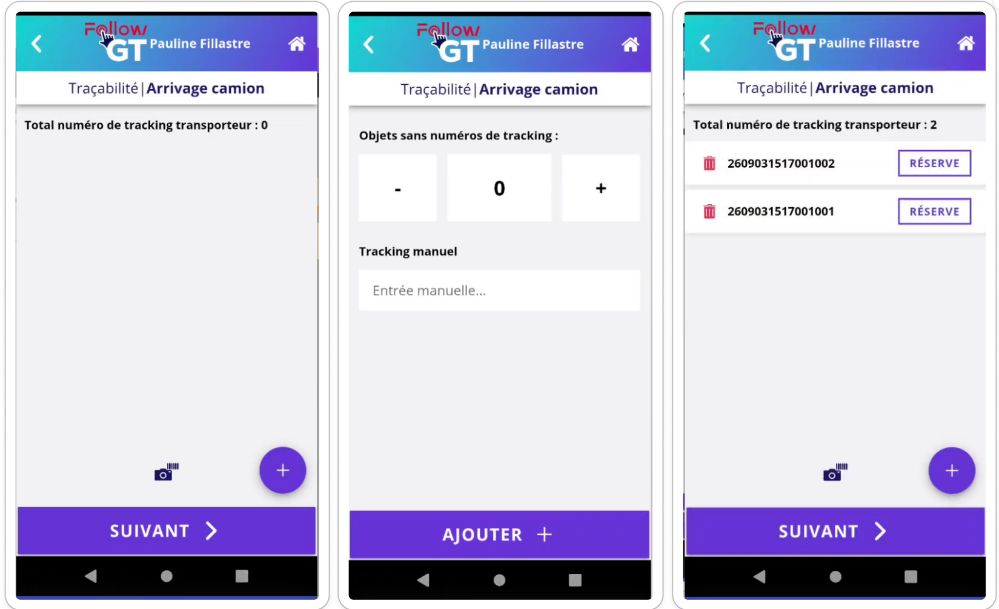

# Mise à jour - Evolution sur l'arrivage camion, nouveau référentiel Contact et connexion SSO

## Arrivage camion - Génération de trackings&#x20;

**Problématique** : _Lors du remplissage du déclaratif de l'arrivage camion, vous devez scanner les numéros de tracking déposés par le transporteur. Cependant, il arrive que le transporteur n'ait pas de numéro de tracking à scanné (taxi, autre) ou qu'un des code soit endommagé et donc non scannable._&#x20;

**Fonctionnement** : Dans le menu Nomade Arrivage camion, après avoir renseigner les champs obligatoires, vous accéder à la page de scan des numéros de tracking. Avec le bouton + dans le menu nomade, vous pouvez maintenant générer des numéros de trackings rapidement afin de comptabiliser les éléments manquants dans votre arrivage. &#x20;

Les numéros de tracking générés ont les mêmes caractéristiques que ceux scannés (réserve sur tracking, etc).&#x20;

<figure><figcaption></figcaption></figure>

## Le référentiel Contact

**Problématique** : _Les destinataires d'emails ou de colis renseignés dans FollowGT devait obligatoirement avoir un compte utilisateur sur FollowGT même s'ils n'avaient aucun besoin de connexion._&#x20;

**Fonctionnement** : Pour renforcer la sécurité et mieux répartir les droits de chacun, nous avons créé un référentiel Contact fusionné au référentiel Client qui permet d'appeler des "Contacts" dans les différents formulaires de FollowGT sans que ces personnes aient un compte utilisateur.&#x20;

Chaque utilisateur à un contact qui lui est associé pour porter toutes les informations communes aux contacts. Mais un contact peut ne pas être lié à un utilisateur.&#x20;

<figure><figcaption></figcaption></figure>

<figure><figcaption></figcaption></figure>

## La connexion SSO

**Problématique** : _Les utilisateurs FollowGT se connectent avec un identifiant et un mot de passe spécifique, ce qui ajoute un système de connexion supplémentaire à retenir. Afin de simplifier les méthodes de connexion pour les utilisateurs, la connexion via un fournisseur d'identité à été développée._&#x20;

**Fonctionnement** : Le système de connexion des utilisateurs est différent en fonction de l'usage du SSO ou pas (associé au nom de domaine - ex : wiilog.fr).&#x20;

* Si vous êtes en fonctionnement SSO, vous devrez renseigner votre adresse email dans le champ identifiant et vous serez rediriger vers la page de connexion de votre fournisseur d'identité. Vous ne pourrez pas faire "mot de passe oublié" ou créer un nouveau compte car tout est géré via le fournisseur d'identité.&#x20;
* Si vous n'êtes pas en SSO, vous devrez renseigner votre adresse email dans le champ identifiant puis votre mot de passe. Vous aurez toujours la possibilité de faire la procédure de mot de passe oublié ou de créer un nouveau compte.&#x20;

Lorsqu'un utilisateur hors SSO demande un compte, l'administrateur qui reçoit l'email de demande de compte peut cliquer sur le lien de redirection dans l'email de demande de compte afin de créer l'utilisateur sur FollowGT.&#x20;
