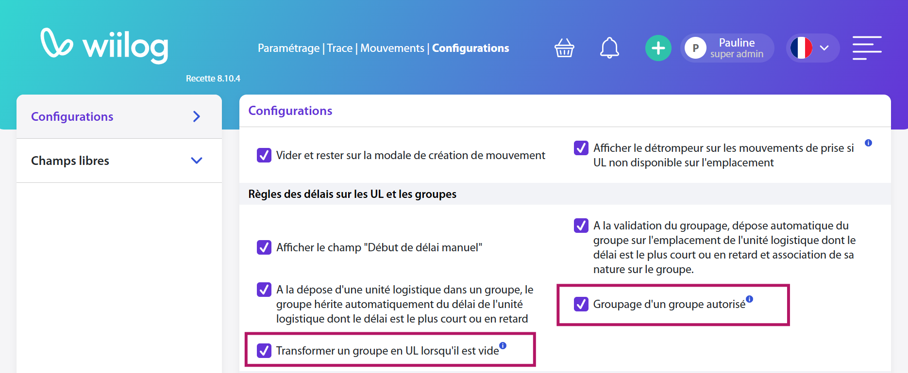

# Mise à jour - Groupes et liens de redirection

## Projet Groupages de groupes et transformation en UL

De nouveaux paramétrages ont étés ajoutés sur la page des mouvements afin de permettre aux opérateurs de :&#x20;

* Transformer un groupe en UL lors du dégroupage
* Grouper un groupe dans un autre

<figure><figcaption></figcaption></figure>

***

## Projet amélioration navigation&#x20;

Afin de faciliter l'usage de Follow, nous avons livré les fonctionnalités suivantes :&#x20;

* NOMADE - Trace | Lecture : Il est maintenant possible d'enchainer les scans d'UL sans revenir en arrière.
* WEB - Traçabilité | Unités logistiques : La liste des unités logistiques dispose désormais de la colonne "Numéro de tracking" qui peut être affichée depuis le bouton "Gestion des colonnes".
* NOMADE - Livraison manuelle sur les références : Il est maintenant possible de faire des livraisons manuelles sur des références gérées à la référence.&#x20;
