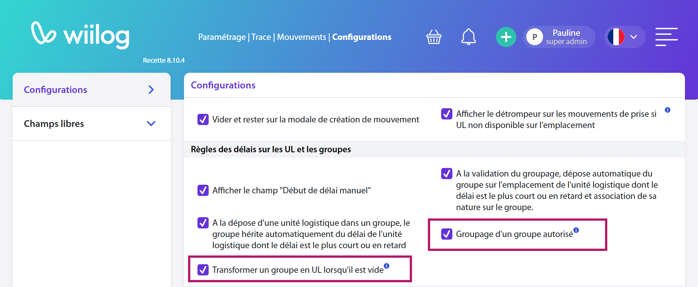

# Premiers pas

## Création de vos instances

Vos instances (page web qui vous donne accès à l'application et ses fonctionnalités) sont créées par Wiilog. Vous aurez une instance de production et une instance de recette. La page de connexion se présente ainsi :



Créez votre premier compte utilisateur en cliquant sur <mark style="background-color:blue;">**Créer un compte**</mark> et demandez à Wiilog de vous accorder un rôle. Les rôles peuvent ensuite être paramétrés avec l'aide de Wiilog et selon les fonctionnalités que vous souhaitez utiliser.

## Création d'utilisateurs

### Via la page de connexion:&#x20;

Tout comme vous, un utilisateur a la possibilité d'utiliser l'option "Créer un compte" disponible sur la page de connexion de votre instance. Ensuite, il sera nécessaire de lui assigner un rôle approprié en fonction de son utilisation de l'application. Pour finaliser le processus, il conviendra de valider son compte en utilisant un compte déjà approuvé et ayant les droits requis pour réaliser ces démarches.&#x20;

### Via Paramétrage | Données | Imports & mises à jour :&#x20;

Si votre rôle le permet, vous avez la possibilité de créer des utilisateurs en masse en utilisant le module "Paramétrage | Données | Imports & mises à jour". Après avoir cliqué sur le bouton "<mark style="background-color:blue;">+ Nouvel import</mark>", sélectionnez "Utilisateur" comme valeur pour le champ "Type de données à importer". Votre fichier à importer doit être au format CSV encodé en UTF-8 et doit être conforme au modèle de document vierge que vous pouvez télécharger en cliquant sur le bouton "<mark style="background-color:blue;">Télécharger</mark>" disponible.&#x20;

### Via Paramétrage | Utilisateurs :&#x20;

Si votre rôle vous le permet, vous avez la possibilité de créer un nouvel utilisateur en accédant au module "Paramétrage | Utilisateurs" et en cliquant sur le bouton "<mark style="background-color:blue;">Nouvel utilisateur</mark>". Le formulaire de création s'affichera, vous permettant de saisir les informations nécessaires. Assurez-vous de cocher la case "<mark style="background-color:blue;">Statut actif</mark>" et d'attribuer le rôle approprié en fonction de l'utilisation prévue de l'application. \

## Première installation sur un terminal Android Zebra.

Avant de profiter des fonctionnalités liées au scanner sur les terminaux Zebra lors de l'utilisation de l'application Follow GT, vous devez importer le profil Datawedge. Ce profil permettra de relier les données capturées par le terminal. Pour ce faire, veuillez scanner le QR code ci-dessous en utilisant l'application StageNow, qui est disponible nativement sur les terminaux Zebra.

Lorsque cette étape est achevée, le profil WIISTOCK est désormais disponible et configuré dans l'application Datawedge.

<figure><figcaption></figcaption></figure>

L’installation de Follow gt s’effectue en utilisant Stagenow et le QR code suivant :

<figure><figcaption></figcaption></figure>

## Mise à jour de l’application nomade sur un terminal Android Zebra

Certaines mises à jour de l'application exigent également une mise à jour de l'application nomade. À cet effet, je vous présente ci-dessous les méthodes disponibles pour réaliser ces mises à jour.&#x20;

### Mise à jour via l'interface nomade de Follow-GT. &#x20;

Lorsqu'une mise à jour est nécessaire sur les appareils nomades, la page suivante apparaît lors de la connexion de l'utilisateur : &#x20;

<figure><figcaption></figcaption></figure>

Le message suivant peut apparaître. Dans ce cas, il vous suffira de cliquer sur "<mark style="background-color:blue;">Télécharger quand même</mark>".

<figure><figcaption></figcaption></figure>

#### Note concernant la sécurité lors du téléchargement de l'application :&#x20;

Lorsque vous effectuez le téléchargement de notre application, il est possible que vous rencontriez le message "Fichier potentiellement dangereux". Nous tenons à vous informer que ce message est une procédure de sécurité standard mise en place par le système d'exploitation Android. Son objectif principal est de protéger les utilisateurs contre tout risque lié au téléchargement de fichiers pouvant compromettre la sécurité de leurs appareils.&#x20;

&#x20;Nous comprenons que cette notification puisse susciter des interrogations et des inquiétudes. Cependant, nous souhaitons vous rassurer en vous affirmant que Follow-GT a été développée en conformité avec les meilleures pratiques en matière de sécurité informatique. En tant que développeurs de l'application, nous avons le contrôle total sur la source de téléchargement et nous sommes en mesure de garantir l'intégrité et la sécurité de notre application. Nous tenons à préciser que les seuls fichiers que nous recommandons et garantissons sont ceux hébergés sur notre serveur FTP officiel.&#x20;

&#x20;La sécurité de nos utilisateurs est une priorité absolue pour nous. Si vous avez d'autres questions ou préoccupations relatives à la sécurité ou à l'utilisation de Follow-GT, n'hésitez pas à nous contacter. Votre confiance est essentielle, et nous sommes là pour vous fournir toutes les informations nécessaires.&#x20;


&#x20;Dans le cas où ce n'est pas la première fois qu'une mise à jour est effectuée sur cet appareil Android, si vous souhaitez réinstaller le fichier, il vous suffira de cliquer sur le bouton "Retélécharger". Une fois le téléchargement terminé, la fenêtre suivante apparaîtra. Pour ouvrir le fichier téléchargé, il vous suffira simplement de cliquer sur le bouton "<mark style="background-color:blue;">Ouvrir</mark>".&#x20;


<figure><figcaption></figcaption></figure>

Si vous ne disposez pas du temps nécessaire pour cliquer immédiatement et que la fenêtre précédente ne reste plus à l'écran, ne vous inquiétez pas. Vous pouvez facilement retrouver le fichier à ouvrir

<figure><figcaption></figcaption></figure>

En cliquant sur les trois points situés en haut à gauche de votre écran, puis en sélectionnant l'option "Téléchargements".

<figure><figcaption></figcaption></figure>

Puis cliquer sur "<mark style="background-color:blue;">Installer</mark>" puis "<mark style="background-color:blue;">Ouvrir</mark>".&#x20;

L’application est mise à jour vous pouvez vous connecter. 👌

### **Téléchargement manuel**&#x20;

Pour télécharger manuellement le fichier APK de l'application Follow GT/Wiilog, suivez les étapes suivantes :

1. Ouvrez un navigateur internet sur votre terminal mobile Android.
2. Rendez-vous à l'adresse suivante : `https://{instance internet que vous souhaitez utiliser}/telecharger/nomade.apk`. Par exemple, si vous souhaitez effectuer les tests sur votre instance de recette, utilisez l'adresse `https://abc1-rec.follow-gt.fr/telecharger/nomade.apk`.
3. Le téléchargement du fichier APK s'effectue automatiquement.

Une fois les tests sur l'instance de recette terminés et que vous souhaitez réinstaller l'application de production sur votre terminal, procédez comme suit :

1. Désinstallez manuellement l'application de recette de votre terminal.
2. Ouvrez un navigateur internet sur votre terminal mobile Android.
3. Rendez-vous à l'adresse suivante : `https://abc1-prod.follow-gt.fr/telecharger/nomade.apk`.
4. Le téléchargement du fichier APK s'effectue automatiquement.
5. Une fois le fichier APK téléchargé, vous pouvez [l'installer sur votre terminal](premiers-pas.md#mise-a-jour-manuelle-procedure-de-mise-a-jour-de-lenvironnement-de-recette).

### Désinstaller Follow GT/Wiilog

Pour désinstaller l'application Follow GT/Wiilog de votre terminal Android, suivez les étapes suivantes :

1. Ouvrez le menu des applications de votre terminal.
2. Appuyez de manière prolongée sur l'icône de l'application Follow GT/Wiilog.
3. Appuyez sur "Désinstaller" pour confirmer la désinstallation de l'application.\

### Mise à jour à l'aide de Stagenow

La procédure de mise à jour peut être effectuée en utilisant l'application Stagenow, disponible sur les appareils Zebra. Pour mettre à jour via Stagenow, il vous suffira de scanner un QR code spécifique à l'aide de cette application. Ce QR code est accessible depuis la page de connexion de votre instance de production. Il vous suffit de survoler le Code-barres avec votre souris, situé au-dessus du formulaire de connexion. Une fois scanné, le processus de mise à jour sera initié.

<figure><figcaption></figcaption></figure>


Lors du premier redémarrage de l'application, vous devrez réintroduire l'URL de votre instance de production. Pour simplifier cette procédure, je vous conseille de créer un code QR en utilisant un site en ligne gratuit tel que "[https://barcode.tec-it.com/fr/QRCode?data=](https://barcode.tec-it.com/fr/QRCode?data=)". Vous pourrez ensuite imprimer le code QR et le réutiliser selon vos besoins.&#x20;


### Mise à jour manuelle (_Procédure de mise à jour de l'environnement de recette_)

Lors d'une phase de test d'une nouvelle fonctionnalité sur votre environnement de recette, il peut être nécessaire d'effectuer une mise à jour de l'application vers une version spécifique qui est en cours de test. Pour tester cette version de recette, vous devrez suivre la procédure de mise à jour manuelle. Étant donné que cette version est en phase de test, son numéro peut évoluer au cours de cette phase. Dans ce cas, vous pouvez contacter le support de l'application pour obtenir le numéro de version exact à télécharger. Pour effectuer une mise à jour manuelle sur un appareil Android, veuillez suivre les étapes ci-dessous dans l'ordre indiqué :&#x20;

&#x20;

1. [Désinstallation de Follow-GT](premiers-pas.md#desinstaller-follow-gt-wiilog) : Supprimez la version précédente de Follow-GT de votre appareil.&#x20;
2. [Téléchargement de la version de test](premiers-pas.md#telechargement-manuel) : Téléchargez la version de test actuelle de Follow-GT pour votre période de test.&#x20;
3. Installation de Follow-GT : Installez la nouvelle version de Follow-GT sur votre appareil.&#x20;

&#x20;

Nous vous encourageons vivement à entrer en contact avec l'équipe du support Wiilog lors de votre première tentative de cette manipulation. Si vous rencontrez le moindre obstacle ou avez des questions concernant cette procédure, leur expertise est à votre disposition pour vous assister.&#x20;

Ces étapes vous permettront d'assurer une mise à jour en toute fluidité de l'application. Si vous avez des questions supplémentaires, n'hésitez pas à nous contacter.&#x20;

