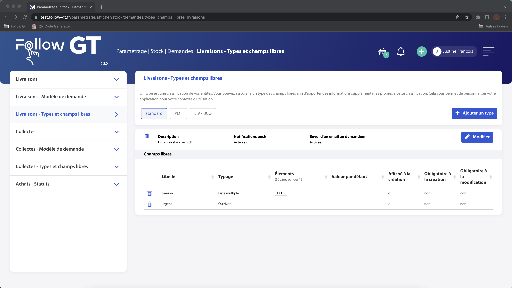

# Types et champs libres

Les types permettent de venir différencier des flux différents de demande de livraison.

Chaque type possède également des champs libres, qui sont des champs permettant d'amener de l'information supplémentaire propre à chaque flux.

La page des types et champs libres est constituée de 3 zones :

* L'entête avec la liste des types et le bouton **Ajouter un type**. Chaque type est cliquable et permet d'aller voir les caractéristiques du type et ses champs libres
* Les caractéristiques du type et le bouton **Modifier**, pour modifier les caractéristiques et les champs libres
* La liste des champs libres du type

<figure><figcaption>
Page types et champs libres
</figcaption></figure>

#### **Ajouter un type** 

Pour ajouter un type, cliquez sur le bouton **Ajouter un type**, à droite de la liste des types.

Remplissez ensuite les champs des caractéristiques de cette façon :

* **Libellé\*** : nom du type, apparaîtra partout dans l'application
* **Description** : description du type, non obligatoire
* **Notifications push** : choisissez de déclencher, ou non, des notifications sur le terminal mobile pour ce type
* **Envoi d'un email au demandeur** : si vous cochez ce paramétrage, un email sera envoyé au demandeur quand la demande sera traitée

Vous pouvez ensuite ajouter des champs libres sur ce type en cliquant sur la ligne avec le +, et en complétant le tableau de la façon suivante :

* **Libellé\*** : nom du champ libre. Le nom doit être différent de tous les champs libres paramétrés sur l'application
* **Typage\*** : contenu du champ. A choisir parmi la liste suivante :
  * **Texte** : champ pouvant contenir n'importe quel caractère
  * **Nombre** : champ pouvant contenir seulement des chiffres
  * **Oui/Non** : champ où le choix de réponse est entre Oui ou Non
  * **Date** : champ pouvant contenir seulement une date. Il ouvre un calendrier pour sélectionner une date
  * **Date et heure**: champ pouvant contenir seulement une date et une heure. Il ouvre un calendrier pour sélectionner une date et un sélecteur d'heure
  * **Liste** : valeur du champ à sélectionner parmi une liste de valeurs paramétrée à la colonne suivante. Il sera seulement possible de sélectionner une valeur
  * **Liste multiple** : valeurs du champ à sélectionner parmi une liste de valeurs paramétrée à la colonne suivante. Il sera possible de sélectionner plusieurs valeurs
* **Eléments** : valeurs possibles pour les champs de type Liste et Liste multiple. Ecrivez ici les éléments de la liste, en les séparant par un ;
* **Valeur par défaut** : valeur par défaut du champ libre. Selon le type du champ libre, la sélection de la valeur par défaut s'adapte
* **Affiché à la création** : cochez ce paramétrage pour que le champ apparaisse à la création d'un acheminement
* **Obligatoire à la création** : cochez ce paramétrage pour qu'il ne puisse pas être possible de créer un acheminement sans avoir saisi ce champ
* **Obligatoire à la modification** : cochez ce paramétrage pour qu'il ne puisse pas être possible de modifier un acheminement sans avoir saisi ce champ

Une fois que vous avez rempli les caractéristiques et les champs libres du type (vous n'êtes pas obligé d'avoir des champs libres), cliquez sur **Enregistrer** pour voir le nouveau type apparaître à la suite des autres.

Ajouter un types et ses champs libres

#### **Modifier un type et ses champs libres** 

Pour modifier un type et ses champs libres, cliquez sur le bouton **Modifier** à droite des caractéristiques du type.

La page passe alors en mode modification. Vous pouvez modifier les caractéristiques et les champs libres de la même façon que décrit au-dessus. Le typage des champs libres ne peut pas être modifié.

N'oubliez pas de cliquez sur **Enregistrer** pour valider votre paramétrage.

Modifier un type et ses champs libres

#### **Supprimer un type et ses champs libres** 

Vous pouvez supprimer un type et ses champs libres grâce aux poubelles : une à gauche des caractéristiques du type pour supprimer le type, une sur chaque ligne de champs libres pour supprimer un champ libre. Ces poubelles sont présentes en mode visualisation et mode modification.

Pour supprimer un type, le type ne doit plus avoir des champs libres et ne pas être utilisé sur les livraisons.

### Champs fixes 

Les champs fixes permettent de choisir quels champs sont disponibles sur le formulaire de création d'un livraison, de modification, et s'il est possible de filtrer sur ce champ ou non.

Pour chaque champ, choisissez les éléments suivants :

* **Formulaire de création :**
  * **Afficher** : cochez la case pour que le champ soit présent sur le formulaire de création d'une réception
  * **Obligatoire** : cochez la case pour qu'il ne soit pas possible de créer une réception sans que ce champ soit renseigné sur le formulaire de création de réception
* **Formulaire d'édition :**
  * **Afficher** : cochez la case pour que le champ soit présent sur le formulaire de modification d'une réception
  * **Obligatoire** : cochez la case pour qu'il ne soit pas possible de valider la modification d'une réception sans que ce champ soit renseigné sur le formulaire de modification d'une réception
* **Sur les filtres :**
  * **Afficher** : cochez la case pour que le champ soit présent dans la barre de filtres de la page des réceptions. Si la case est grisée, cela signifie que ce champ n'est pas disponible au filtrage

Champs fixes livraison

N'oubliez pas de cliquez sur **Enregistrer** pour valider votre paramétrage.

