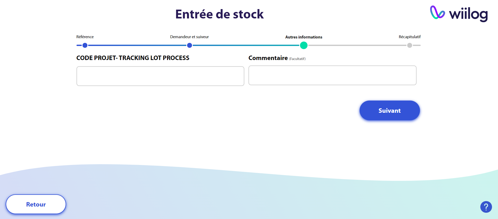

# Demande collecte et création référence

## Fonctionnement général

La borne va réaliser les actions suivantes sur Follow :&#x20;

* Créer une nouvelle référence en quantité 1, gérée à l'article avec 1 article dans la quantité choisie sur la borne au statut "consommé".&#x20;
* Créer une demande de collecte au statut "validée" et un ordre de collecte au statut "A traiter".&#x20;
* Génerer une étiquette d'article.&#x20;

Les informations générales de la références et de la demande de collecte seront celles pré-remplies dans les paramétrages.&#x20;

Il faudra que l'opérateur traite l'ordre de collecte pour créer le mouvement d'entrée de stock de l'article et le faire passé au statut "disponible".&#x20;

## Step by step sur la borne

Dès l'ouverture du lien de la borne, vous obtiendrez la page d'accueil de la borne tactile. Celle-ci vous propose de scanner votre référence pour la rentrée en stock. Vous pouvez également choisir de rentrer les informations de l'article ou référence manuellement via le bouton **"**<mark style="background-color:blue;">**Faire une entrée manuelle".**</mark>


La borne a été développée pour créer des références gérées à l'article uniquement. Il est impossible de scanner une référence déjà connue du système.

La quantité par défaut de la référence est 1.


<figure><figcaption>
Page principale de la borne tactile
</figcaption></figure>

Après scan ou sélection de l'entrée manuelle, vous devrez rentrer les informations de la référence (Nom et libellé).

<figure><figcaption></figcaption></figure>

Puis, vous devrez rentrer votre nom pour identifier la personne qui rentre la nouvelle réfréence dans le système mais aussi un utilisateur qui recevra un mail de confirmation de l'entrée en stock de cette référence.&#x20;

<figure><figcaption></figcaption></figure>

Enfin, vous devrez rentrer les champs libres paramétrés pour le type d'entrée en stock paramétré par défaut sur la borne. Certains des champs peuvent être facultatifs.

<figure><figcaption></figcaption></figure>

Pour la dernière étape, vous aurez un récapitulatif des informations renseignées en amont.

<figure><figcaption></figcaption></figure>

En cliquant sur <mark style="background-color:blue;">**"Valider"**</mark>, une étiquette article sera automatiquement téléchargée.

<figure><figcaption></figcaption></figure>

