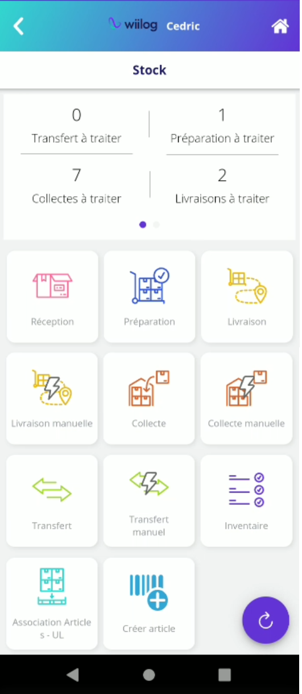

# Fonctionnalités mobile

Vous retrouverez les fonctionnalités de stock sur le mobile via le Menu Stock. Pour y avoir accès, activez les fonctionnalités que vous allez utiliser dans l'interface web sous : [Paramétrage > Utilisateurs > Rôles > Nomade > Stock  ](../../parametrages/utilisateurs/roles/nomade.md)\
Vous pourrez paramétrer les menus que ce rôle pourra afficher sur son terminal mobile :&#x20;

<figure><figcaption>
Menu Nomade Stock
</figcaption></figure>

