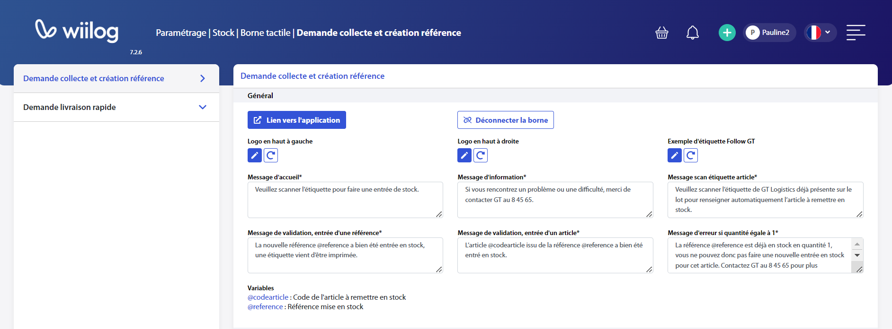
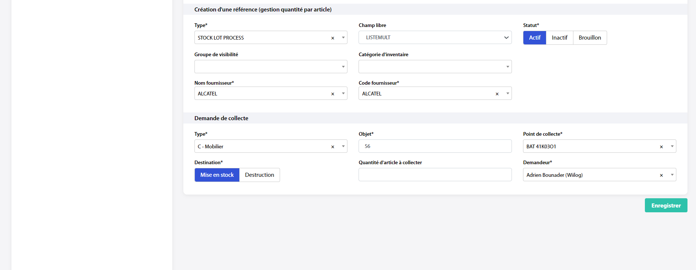
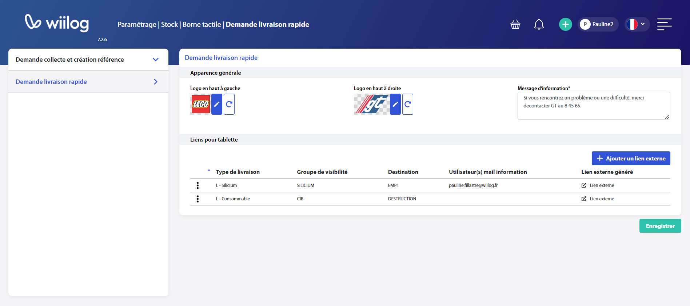
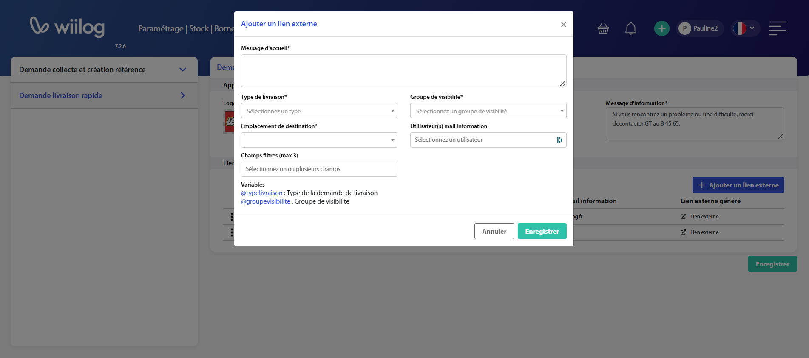

# Borne tactile

## Demande collecte et création référence

Vous pouvez paramétrer les logos qui apparaîtront sur la borne tactile mais aussi les messages d'accueil, d'information, de scan d'étiquettes article, de validation, et d'erreur.&#x20;

<figure><figcaption>
Capture d'écran des paramétrages
</figcaption></figure>

Vous devez paramétrer par défaut les informations de la création d'une référence qui sera forcément en gestion quantité article. Cette manipulation permettra de facilitrer le flux sur la borne car l'ensemble des informations paramétrées ici ne seront plus à remplir.&#x20;

<figure><figcaption>
Capture d'écran des paramétrages
</figcaption></figure>

## Demande livraison rapide

Sur le même principe que les demande de collecte via borne, vous pouvez paramétrer les logo qui apparaitront sur l'écran mais aussi le message d'information.&#x20;

<figure><figcaption>
Capture d'écran des paramétrages
</figcaption></figure>

Vous devrez créer des liens externes qui seront les liens des demande de livraison simplifiées. Les informations obligatoires sont :&#x20;

* le message d'accueil avec les variables type de livraison et groupe de visisbilité.&#x20;
* le duo : type de livraison et groupe de visibiilté
* l'emplacement de destinataion
* un utilisateur qui recevra les mails de notifications de sortie de stock
* des champs filtres pour aider dans la recherche de références

<figure><figcaption>
Capture d'écran des paramétrages
</figcaption></figure>
