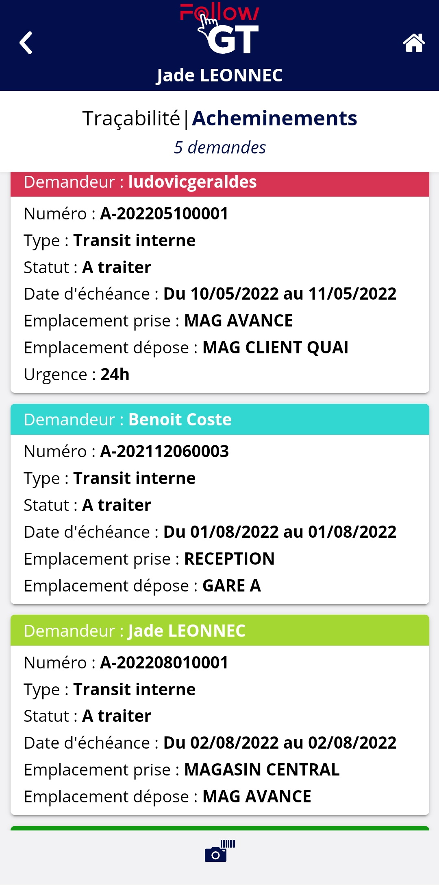

# Traçabilité I Acheminements

Pour accéder à la liste des acheminements à traiter, appuyez sur le menu <mark style="background-color:blue;">**Traçabilité**</mark> puis <mark style="background-color:blue;">**Acheminements**</mark>

### Liste des acheminements

**Informations sur la vignette d'acheminement**

Chaque acheminement est représenté par un vignette rectangulaire qui contient les informations suivantes :&#x20;

* **Demandeur** : placé dans l'entête de couleur, personne ayant créée la demande d'acheminement
* **Numéro** : numéro de la demande d'acheminement généré par l'application
* **Statut** : statut de la demande d'acheminement&#x20;
* **Date d'échéance** : date à laquelle la demande d'acheminement doit être effectuée. Ce champ apparaît seulement si des dates d'échéance sont renseignées sur l'application
* **Emplacement prise** : emplacement d'où doivent être prises les unités logistiques à acheminer
* **Emplacement dépose** : emplacement où doivent être déposées les unités logistiques à acheminer
* **Urgence** : niveau d'urgence de l'acheminement. Ce champ apparaîtra seulement si un niveau d'urgence a été renseigné sur l'acheminement

**Couleur d'entête**&#x20;

Les acheminements sont présentés de celui à faire le plus rapidement à celui le moins pressant.&#x20;

Chaque vignette a une entête colorée. Cette couleur peut varier en fonction de la date d'échéance renseignée sur l'acheminement. Cette couleur se paramètre au préalable dans [Terminal mobile > Acheminements](../parametrage-terminal-mobile/mobile-acheminements.md)

Sur l'exemple montré en bas, les acheminements dont la date d'échéance est une date dans le passé sont en rouges, ceux dont la date d'échéance est pour le jour même sont en bleu, et ceux à faire dans le futur sont en vert clair.&#x20;

Les acheminements n'ayant pas de date d'échéance auront une entête couleur vert sapin.

**Filtre sur numéro**

Si vous avez un QR Code ou un code barre avec le numéro de l'acheminement, vous pouvez le flasher, ou le scanner en appuyant sur l'appareil photo, pour arriver directement sur le détail de l'acheminement pour le traiter.

### Traiter un acheminement

Accédez au détail de l'acheminement pour le traiter en appuyant sur la vignette de l'acheminement souhaité. Vous pouvez aussi y accéder via scan du numéro d'acheminement comme expliquer ci-dessus ou bien en appuyant sur la notification de nouvel acheminement si vous avez paramétré les notifications (notifications à paramétrer sur le paramétrage du type de l'acheminement).

Chaque unité logistique à acheminer est représentée par une vignette rectangulaire qui contient les informations suivantes :&#x20;

* **Colis** : numéro de l'unité logistique
* **Quantité** : quantité contenue dans l'unité logistique
* **Nature** : nature qui caractérise l'unité logistique
* **Dernier emplacement** : dernier emplacement sur lequel l'unité logistique a été déposée

**Passer les unités logistiques dans la zone Transféré**

Pour traiter un acheminement, il vous faut passer toutes les unités logistiques qui sont dans la zone "_**A transférer**_" dans la zone "_**Transféré**_". Pour cela, scannez les.

Vous avez aussi la possibilité de les scanner via l'appareil photo de votre terminal mobile, ou d'appuyer sur les flèches présentes dans la vignette pour que l'UL change de zone. Vous pouvez aussi appuyer sur la grande flèche pour tout passer d'un coup dans la zone "_**Transféré**_".

Dans un acheminement, vous pouvez seulement scanner des unités logistiques qui sont demandées en acheminement dans celui-ci. Si vous scannez une UL qui ne fait pas partie de la liste, un message d'erreur apparaîtra.&#x20;

**Ajouter des photos sur l'acheminement**

Lorsque vos unités logistiques sont passées dans la zone "_**Transféré**_", vous pouvez appuyer dessus pour accéder à l'écran de modification d'un colis. Sur cette page, vous pouvez modifier la nature et la quantité de l'unité logistique, et surtout ajouter jusqu'à 2 photos. Appuyez sur l'appareil photo vert pour prendre une photo. Pour supprimer une photo que vous avez prise, appuyez dessus.

Les photos seront disponibles sur la zone _Pièce-jointe_ du détail d'un acheminement sur la supervision ainsi que sur les mouvements générés par l'acheminement lorsque celui-ci est traité.&#x20;

**Supprimer un colis de la zone Transféré**

Lorsque les unités logistiques sont passées dans la zone "_**Transféré**_", la flèche est remplacée par une poubelle rouge. Si vous appuyez sur une des ces poubelles, l'unité logistique repassera dans la zone "_**A transférer**_"&#x20;

**Sélectionner l'emplacement de dépose finale**

Lorsque toutes les UL sont passées dans la zone "Transféré", appuyez sur VALIDER pour passer à l'étape de validation de l'emplacement de dépose.

Vous arrivez alors sur l'écran pour sélectionnez l'emplacement. Vous pouvez le scanner avec le scan du zebra, le flasher avec l'appareil photo en l'ouvrant en appuyant sur l'appareil photo, ou le sélectionner à la main via la loupe.&#x20;

Sur un acheminement, il faut sélectionner l'emplacement de dépose demandé, sinon un message d'erreur apparaît. Il n'est pas possible de déposer les UL sur un emplacement différent.&#x20;

**Sélectionner le statut final**

Une fois l'emplacement de dépose flashé et validé, vous êtes dirigé vers l'écran de sélection du statut final. Sur cet écran, tous les statuts du type de l'acheminement en état _Traité_ vous sont proposés. Sélectionnez celui qui correspond à votre traitement de l'acheminement.&#x20;

L'acheminement disparait alors de la liste des acheminements à traiter sur le nomade.&#x20;

### Impacts sur la supervision

Une fois que l'acheminement a été traité sur le nomade, les informations suivantes changent sur la supervision :&#x20;

Sur le détail de l'acheminement :&#x20;

* Sur l'entête, les champs suivants sont complétés :&#x20;
  * **Traité par** : le champ est complété par l'opérateur ayant traité l'acheminement sur son terminal
  * **Date de traitement** : date et heure du traitement de l'acheminement par l'opérateur
  * **Pièces jointes** : si des photos ont été ajoutées sur les unités logistiques, vous les retrouverez dans cette section au traitement de l'acheminement
* Sur la liste des colis, les champs suivants sont modifiés :&#x20;
  * **Date dernier mouvement** : la date et heure qui était marquée est remplacée par la date et heure du traitement de l'acheminement
  * **Dernier emplacement** : le dernier emplacement de l'unité logistique qui était renseigné est remplacé par l'emplacement de dépose de l'acheminement
  * **Opérateur** : l'opérateur indiqué est celui ayant traité l'acheminement
  * **Statut** : le statut passe à _Traité_ pour toutes les unités logistiques. Si seulement une partie est en Traité, seulement signifie que votre acheminement est en état Partiel. Voir plus bas pour ce fonctionnement

Sur la page des mouvements de traçabilité : lorsqu'un acheminement est traité, un mouvement de prise de l'emplacement de prise et un mouvement de dépose sur l'emplacement de dépose est créé pour chaque unité logistique acheminée. Dans la colonne "Issu de", il est noté que le mouvement est issu d'un acheminement avec le numéro de celui-ci. Vous pouvez cliquer dessus pour être redirigé vers l'acheminement à l'origine du mouvement. Si vous avez pris des photos sur votre acheminement, vous verrez l'icône de trombone qui indique une pièce jointe sur le mouvement.&#x20;

### Traiter partiellement un acheminement

Il est possible de traiter partiellement un acheminement si vous n'êtes pas en mesure d'acheminer toutes les unités logistiques demandées en une fois.&#x20;

Il faut vérifier au préalable de bien avoir un statut _Partiel_ paramétré pour le type d'acheminement en question.&#x20;

Passez dans la zone "_**Transféré**_" les unités logistiques que vous pouvez acheminer dans un premier temps et cliquez sur <mark style="background-color:blue;">**VALIDER**</mark>.

Sélectionnez l'emplacement de dépose, et passez à l'étape de sélection du statut. Seuls les statuts en état _Partiel_ vous sont alors proposés. Sélectionnez le statut et validez.

L'acheminement est alors passé au statut en état Partiel et vous pouvez toujours le traiter dans la liste des acheminements à traiter.&#x20;

Sur la supervision, l'acheminement a un statut en état partiel et dans la liste des UL, seules les UL transférés sont indiquées comme traitées. Les autres ont toujours un statut A _traiter._&#x20;
