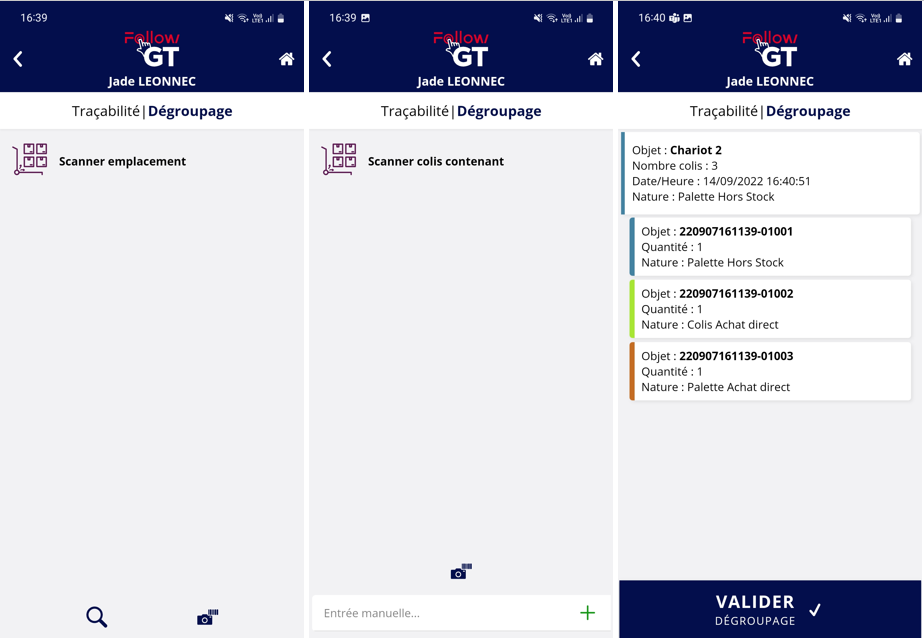

# Groupage/Dégroupage

Le groupage permet de venir associer plusieurs unités logistiques à un contenant afin de venir déplacer seulement ce contenant pour déplacer en même temps les unités logistiques contenues. Ainsi pour bouger 3 unités logistiques qui sont groupées dans un groupe A, de l'emplacement B à C, il suffira d'une prise et d'une dépose du groupe pour déplacer d'un seul coup les 3 unités logistiques.

Le dégroupage permet d'enlever ce lien entre le contenant et les unités logistiques contenues pour que quand le groupe est bougé, les unités logistiques ne soient plus bougées en même temps.&#x20;

## Groupage

### Faire un groupage

Pour faire un groupage sur le nomade, allez dans le menu <mark style="background-color:blue;">**Traçabilité**</mark> et ensuite sélectionnez <mark style="background-color:blue;">**Groupage**</mark>.

Dans un premier temps, scannez l'unité logistique qui sera le contenant. L'unité logistique scannée ne peut pas être une unité logistique connue déjà comme n'étant pas un groupe. L'élément scanné doit être soit une unité logistique inconnue, soit une unité logistique connue comme un groupe.&#x20;

Lorsque vous avez scanné votre groupe, vous aurez les informations suivantes sur le groupe :&#x20;

* **Objet** : nom/code du groupe
* **Nombre colis** : nombre de colis/unités logistiques contenu déjà dans le groupe
* **Nature** : nature du groupe, si vous en avez mis une

<figure><figcaption></figcaption></figure>

Maintenant que vous avez scanné le groupe, vous pouvez scanner toutes les unités logistiques qui doivent aller dans ce groupe.&#x20;

Chaque unité logistique est dans un rectangle qui contient les informations suivantes :&#x20;

* **Objet** : numéro de l'unité logistique
* **Quantité** : quantité de l'unité logistique
* **Date/Heure** : date et heure du scan de l'UL pour le mettre dans le groupe
* **Nature** : nature de l'unité logistique

Si vous vous êtes trompés en scannant, enlevez l'unité logistique en appuyant sur 

Validez ensuite en appuyant sur 

### Mouvements résultants sur la supervision

Si vous retournez sur la supervision sur la page _**Traçabilité | Mouvements**_, vous verrez des mouvements de groupage résultant montrant le groupage des 3 UL dans le Chariot 2.&#x20;

Le groupage sur le nomade va ainsi créer un mouvement de groupage pour le groupe ainsi que pour chaque unité logistique mise dans le groupe.&#x20;

Vous pouvez aussi aller dans la page _**Traçabilité | Unités logistiques**_, onglet _Groupes_ pour voir le groupe et son contenu.&#x20;

Vous pouvez également faire un groupage sur la supervision à partir de _**Traçabilité | Mouvements**_ en faisant un nouveau mouvement de type "_Groupage_".

## Dégroupage

### Faire une dégroupage

Le menu de dégroupage sur le nomade se trouve à côté du menu <mark style="background-color:blue;">**Groupage**</mark>.

Appuyez sur le menu <mark style="background-color:blue;">**Dégroupage**</mark>.

Dans un premier temps, scannez l'emplacement sur lequel est le groupe pour indiquer où vont aller toutes les unités logistiques contenus dans le groupe.&#x20;

Scannez ensuite le groupe qui contient les unités logistiques que vous voulez désolidariser.

Vous aurez ensuite la visualisation des caractéristiques du groupe et des unités logistiques qui sont contenus dedans.&#x20;

Validez le dégroupage en appuyant sur <mark style="background-color:blue;">**VALIDER DEGROUPAGE**</mark>.&#x20;

<figure><figcaption></figcaption></figure>

### Mouvements résultants sur la supervision

Si vous retournez sur la supervision sur la page _**Traçabilité | Mouvements**_, vous pouvez voir les mouvements résultants de l'action de dégroupage.&#x20;

Pour un dégroupage, vous aurez à chaque fois un mouvement de dégroupage et de dépose sur l'emplacement scanné pour toutes les unités logistiques qui étaient contenues dans le groupe.&#x20;

Vous pouvez aussi aller dans la page _**Traçabilité | Unités logistiques**_, onglet _Groupes_ pour voir que le groupe ne contient plus d'unités logistiques.&#x20;

Vous pouvez faire un dégroupage sur la supervision dans la page _**Traçabilité | Unités logistiques**_, onglet _Groupes_, en cliquant sur les du groupe que vous voulez dégrouper et sur le bouton <mark style="background-color:blue;">**Dégrouper**</mark>.&#x20;
