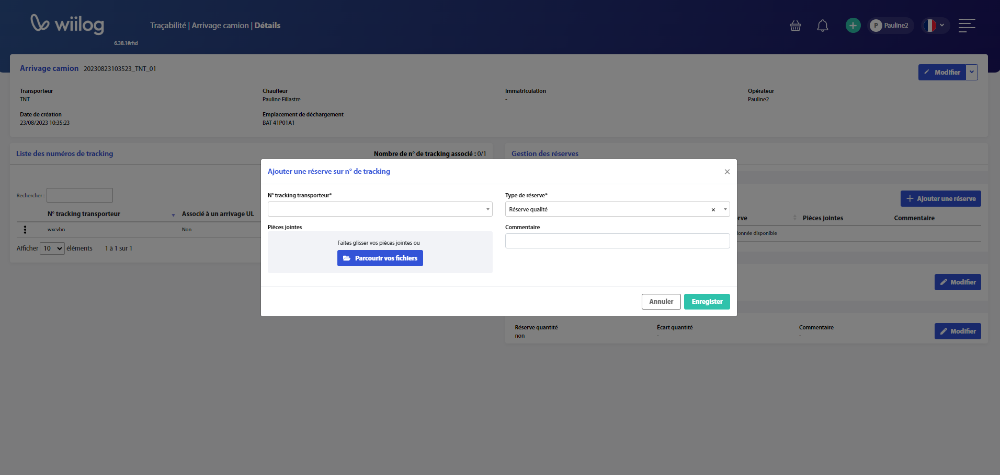
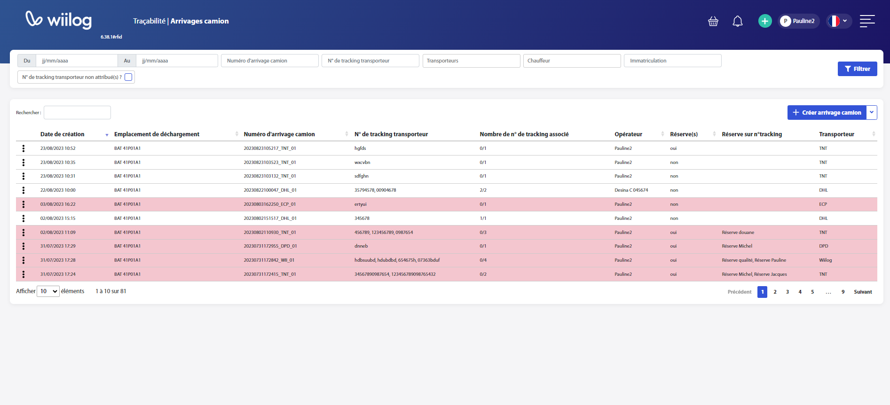

# Arrivages Camion

La fonctionalité "Arrivage camion" version Web est accessible via le menu Traçabilité | Arrivages camion.

## Créer un arrivage camion

La création d'un arrivage camion sur le module Web peut être découpé en 2 parties :&#x20;

1. **Créer l'arrivage camion**

Pour identifier un arrivage camion, vous devez remplir les champs obligatoires paramétrés en amont, soit le transporteur, le chauffeur, la plaque d 'immatriculaion du camion, le fournisseur, le numéro de commande et l'emplacement de déchargement.&#x20;

Vous pouvez ensuite scanner l'ensemble des numéros de tracking transporteur. Un compteur vous aidera à vérifier que l'ensemble des numéros à été scanné.

Enfin, vous pouvez identifier une réserve générale ou une réserve quantité sur l'arrivage dans sa globalité.&#x20;

<figure><figcaption></figcaption></figure>

Pour finir l'enregistrement de l'arrivage camion, vous avez deux options,

* Si vous cliquez sur le bouton "<mark style="background-color:blue;">Enregistrer</mark>", la pop up de création de l'arrivage camion se fermera et vous verrez qu"une nouvelle ligne d'arrivage camion s'est ajouté à votre tableau récapitulatif des arrivages camions. Pour modifier des informations sur cet arrivage camion, il faudra cliquer sur la ligne et vous aurez accès aux détails de cet arrivage camion.
* Si vous cliquez sur le bouton "<mark style="background-color:blue;">Aller vers Arrivage UL</mark>", vous serez rediriger vers la page d'arrivage UL préremplie avec les informations de cet arrivage camion.&#x20;

2. **Identifier des réserves sur numéro de tracking**

Pour identifier des réserves sur numéros de tracking, il faut cliquer sur la ligne de l'arrivage camion qui concerne votre réserve. Puis, cliquer sur le bouton "<mark style="background-color:blue;">Ajouter une réserve</mark>" dans l'encars "Gestion des réserves". Vous devrez alors choisir le numéro de tracking concerné par la réserve, puis le type de réserve. Vous pourrez également ajouter un commentaire et une pièce jointe pour expliciter la réserve.&#x20;

<figure><figcaption></figcaption></figure>

## Voir et filtrer la liste d'arrivages camion

L'intégralité des arrivages camions créés sur web ou nomade est visible dans le tableau de la page Arrivage camion. Ce tableau est filtrable via :&#x20;

* "Du" "Au" => Date de création de l'arrivage camion
* Numéro de l'arrivage camion => Identifiant de l'arrivage camion créé à chaque création d'arrivage camion
* Numéro de tracking transporteur
* Transporteur
* Chauffeur
* Immatriculation&#x20;
* Numéro de tracking non attribué => Tout numéro de tracking n'ayant pas fait l'objet d'un arrivage UL (association numéro de tracking - unité logistique).&#x20;

<figure><figcaption></figcaption></figure>
