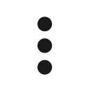

# Arrivages

Cette fonctionnalité est uniquement disponible en web.

Pour accéder à la page, vous devez aller dans le menu **Traçabilité**, puis choisir **flux-arrivages**.

La page des arrivages contient plusieurs éléments :&#x20;

* Une **barre de filtre**, permettant de filtrer les données qui sont affichées dans le tableau
* Une **recherche rapide**, permettant également de filtrer les données affichées dans le tableau
* Un bouton <mark style="background-color:blue;">**Nouvel arrivage**</mark>, destiné à la création d'arrivage
* Un bouton <mark style="background-color:blue;">**Exporter au format CSV**</mark>, sous le bouton **Nouvel arrivage**, destiné à exporter l'ensemble des données filtrées (suivant les dates renseignées) au format CSV
* Un bouton <mark style="background-color:blue;">**Gestion des colonnes**</mark>, sous la bouton **Nouvel arrivage**, permettant de choisir les colonnes à afficher dans le tableau
* Un bouton <mark style="background-color:blue;">**Acheminer**</mark>
* Un **tableau**, regroupant les différents arrivages créés


page arrivages


### Contenu des filtres

Les filtres affichés sont paramétrables dans [<mark style="color:blue;">Paramétrage > Trace > Arrivage > Champs fixes</mark>](broken-reference)<mark style="color:blue;">.</mark> Le tableau ci-dessous récapitule tous les filtres disponibles.

Une fois que vous avez renseigné vos filtres, cliquez sur <mark style="background-color:blue;">**Filtrer**</mark>. Les filtres sont conservés d'une session à l'autre (ils seront toujours actifs si vous changez de page ou que vous vous déconnectez et reconnectez).

| Filtre                     | Description                                                                                                                                                                                                                                                                                                                              |
| -------------------------- | ---------------------------------------------------------------------------------------------------------------------------------------------------------------------------------------------------------------------------------------------------------------------------------------------------------------------------------------- |
| **Du**                     | La tranche basse filtrant sur la date de création de l'arrivage                                                                                                                                                                                                                                                                          |
| **Au**                     | La tranche haute filtrant sur la date de création de l'arrivage                                                                                                                                                                                                                                                                          |
| **Statuts**                | Statut de l'arrivage. Vous pouvez mettre plusieurs statuts pour filtrer sur les arrivages ayant ces statuts assignés (voir [paramétrage des statuts](broken-reference))                                                                                                                                                                  |
| **n° d'arrivage**          | Tapez précisément le numéro de l'arrivage que vous cherchez pour afficher celui-ci                                                                                                                                                                                                                                                       |
| **Douane ?**               | Cliquez sur le switch si vous souhaitez visualiser les arrivages sur lesquels a été activé le switch Douane                                                                                                                                                                                                                              |
| **Congelé ?**              | Cliquez sur le switch si vous souhaitez visualiser les arrivages sur lesquels a été activé le switch Congelé ?                                                                                                                                                                                                                           |
| **Urgence ?**              | Cliquez sur le switch si vous souhaitez visualiser les arrivages identifiés en urgence (Fournisseur urgent ou urgence renseignée au préalable. Voir les pages [<mark style="color:blue;">Référentiel > Fournisseurs</mark>](../../../referentiel/fournisseurs.md) ou [<mark style="color:blue;">Trace > Urgence</mark>](../urgences.md)) |
| **Fournisseurs**           | Pour filtrer par fournisseur renseigné sur l'arrivage. Vous pouvez mettre plusieurs fournisseurs. Ce filtre va chercher dans le [référentiel des fournisseurs](../../../referentiel/fournisseurs.md). Vous devez taper une première lettre pour avoir une suggestion de fournisseurs contenant cette lettre                              |
| **Transporteurs**          | Pour filtrer par transporteur renseigné sur l'arrivage. Vous pouvez mettre plusieurs transporteurs. Ce filtre va chercher dans le référentiel des transporteurs. Vous devez taper une première lettre pour avoir une suggestion de transporteurs contenant cette lettre                                                                  |
| **Utilisateurs**           | Pour filtrer sur la personne ayant créée l'arrivage. Vous pouvez renseigner plusieurs utilisateurs. Ce filtre va chercher dans la liste des utilisateurs renseignées dans l'application. Vous devez taper une première lettre pour avoir une suggestion d'utilisateurs contenant cette lettre                                            |
| **Emplacements de dépose** | Emplacement sur lequel les unités logistiques  sont créés suite à l'arrivage ont été automatiquement déposés                                                                                                                                                                                                                             |

### Contenu du tableau

Les colonnes du tableau affichés à l'écran sont paramétrables en cliquant sur la flèche à droite de <mark style="background-color:blue;">**Nouvel arrivage**</mark> et en choisissant <mark style="background-color:blue;">**Gestion des colonnes**</mark>. Cochez alors les champs que vous souhaitez afficher et <mark style="background-color:blue;">**enregistrez**</mark>. Ce choix sera conservé d'une session à l'autre.&#x20;

En fonction du nombre de champs sélectionnés, une barre horizontale de défilement peut apparaître.&#x20;

| Colonne                      | Description                                                                                                                                                                                                                                                                                                       |
| ---------------------------- | ----------------------------------------------------------------------------------------------------------------------------------------------------------------------------------------------------------------------------------------------------------------------------------------------------------------- |
| **Date de création**         | Date à laquelle a été créé l'arrivage                                                                                                                                                                                                                                                                             |
| **n° d'arrivage**            | Numéro de l'arrivage. Le numéro d'arrivage est généré par l'application au moment de sa création. Il est constitué de l'année, du mois, du jour, de l'heure, de la minute, de la seconde - un compteur                                                                                                            |
| **Transporteur**             | Transporteur renseigné sur l'arrivage                                                                                                                                                                                                                                                                             |
| **Chauffeur**                | Chauffeur renseigné sur l'arrivage                                                                                                                                                                                                                                                                                |
| **N° tracking transporteur** | Numéro de tracking transporteur renseigné sur l'arrivage                                                                                                                                                                                                                                                          |
| **Numéro de commande**       | Numéro de commande renseigné sur l'arrivage. Il est possible que l'arrivage ait plusieurs numéros de commande. Ils seront séparés par une virgule dans le tableau                                                                                                                                                 |
| **Type**                     | Type renseigné sur l'arrivage                                                                                                                                                                                                                                                                                     |
| **Fournisseur**              | Fournisseur renseigné sur l'arrivage                                                                                                                                                                                                                                                                              |
| **destinataire**             | Destinataire renseigné sur l'arrivage                                                                                                                                                                                                                                                                             |
| **acheteurs**                | Acheteur renseigné sur l'arrivage. L'arrivage peut avoir plusieurs acheteurs. Les noms des acheteurs seront séparés par des virgules                                                                                                                                                                              |
| **Nb UL**                    | Nombre total d'unité logistique créé sur l'arrivage                                                                                                                                                                                                                                                               |
| **Douane**                   | Arrivage en douane ou non. Il sera écrit Oui si le switch a été coché, Non s'il n'a pas été coché                                                                                                                                                                                                                 |
| **Congelé**                  | Arrivage en congelé ou non. Il sera écrit Oui si le switch a été coché, Non s'il n'a pas été coché                                                                                                                                                                                                                |
| **Statut**                   | Statut renseigné sur l'arrivage                                                                                                                                                                                                                                                                                   |
| **Utilisateur**              | Utilisateur ayant créé l'arrivage                                                                                                                                                                                                                                                                                 |
| **Urgent**                   | Arrivage urgent ou non. Il sera écrit Oui si l'arrivage est détecté comme urgent, Non s'il n'est pas détecté comme urgent (Fournisseur urgent ou urgence renseignée au préalable. Voir les pages <mark style="color:blue;">Référentiel > Fournisseurs</mark> ou <mark style="color:blue;">Trace > Urgence</mark>) |
| **Numéro de projet**         | Numéro de projet renseigné sur l'arrivage                                                                                                                                                                                                                                                                         |
| **Business Unit**            | Business unit renseigné sur l'arrivage                                                                                                                                                                                                                                                                            |
| **Emplacement de dépose**    | Emplacement de dépose renseigné sur l'arrivage. Si le champ fixe n'est pas affiché sur le formulaire de création, la colonne sera vide                                                                                                                                                                            |

### Créer un nouvel arrivage

Afin de créer un nouvel arrivage, il suffit de cliquer sur le bouton <mark style="background-color:blue;">**Nouvel arrivage**</mark>. Une modale va alors s'ouvrir, permettant ainsi de renseigner plusieurs champs.&#x20;

Les champs affichés sur le formulaire sont paramétrables dans [<mark style="color:blue;">Paramétrage > Trace > Arrivages > Champs fixes</mark>](broken-reference), où vous pouvez choisir de les afficher ou non, ou de les rendre obligatoires ou non.&#x20;

Vous pouvez renseigner les champs suivants :&#x20;

* Le **fournisseur** de l'arrivage. Le champ va chercher dans le [référentiel des fournisseurs](../../../referentiel/fournisseurs.md). Tapez les premiers caractères du fournisseur souhaité pour avoir des propositions de fournisseurs ayant ces lettres dans leur nom. Si le fournisseur n'est pas présent dans la liste, vous pouvez en ajouter un nouveau en cliquant sur le <mark style="background-color:blue;">**+**</mark> à côté du champ, pour renseigner le nom et le code du fournisseur et l'ajouter dans la liste.
* Le **transporteur** de l'arrivage. Le champ va chercher dans le [référentiel des transporteurs](../../../referentiel/transporteurs.md). Tapez les premiers caractères du transporteur souhaité pour avoir des propositions de transporteurs ayant ces lettres dans leur nom. Si le transporteur n'est pas présent dans la liste, vous pouvez en ajouter un nouveau en cliquant sur le <mark style="background-color:blue;">**+**</mark> à côté du champ, pour renseigner le nom et le code du transporteur et l'ajouter dans la liste.
* Le **chauffeur** de l'arrivage. Le champ va chercher dans le [référentiel des chauffeurs](../../../referentiel/chauffeurs.md). Tapez les premiers caractères du chauffeur souhaité pour avoir des propositions de chauffeur ayant ces lettres dans leur nom. Si le chauffeur n'est pas présent dans la liste, vous pouvez en ajouter un nouveau en cliquant sur le <mark style="background-color:blue;">**+**</mark> à côté du champ, pour renseigner son nom, son prénom, et son numéro de document d'identité et l'ajouter dans la liste.
* Le **numéro de tracking transporteur**. Ce champ est un champ texte libre sans contrainte.
* Le **numéro de commande**. Vous pouvez renseigner plusieurs numéros de commande. En tapant le numéro de commande, validez votre saisie en appuyant sur entrée ou en cliquant sur votre saisie.
* Le **type** de l'arrivage. Le type est obligatoire à renseigner. Si un seul type est paramétré il sera renseigné par défaut (pour paramétrer des types, voir [<mark style="color:blue;">Paramétrage > Trace > Arrivages > Types et champs libres</mark>](broken-reference))
* Le **statut** de l'arrivage. Le statut est obligatoire et il peut être sélectionné seulement si le type de l'arrivage est sélectionné. Les statuts sont dépendants du type et paramétrable (dans [<mark style="color:blue;">Paramétrage > Trace > Arrivages > Statuts</mark>](broken-reference) )
* L'**emplacement de dépose** des unités logistiques créées suite à l'arrivage. Il est conseillé d'afficher ce champ fixe seulement si vos transporteurs effectuent des arrivages à des emplacements physiques différents sur votre site. Ce champ va chercher dans le [référentiel des emplacements](../../../referentiel/emplacements.md). Par défaut, l'emplacement renseignée sera celui configuré dans "Emplacement de destination des arrivages" ([<mark style="color:blue;">Paramétrage > Trace > Arrivages > Configurations</mark>](broken-reference)). Sélectionnez un emplacement de dépose différent pour que les unités logistiques soient placés automatiquement sur celui-ci à la validation de l'arrivage.
* Le **destinataire** de l'arrivage. Le champ va chercher dans le [référentiel des utilisateurs](broken-reference). Renseignez le destinataire si les unités logistiques de votre arrivage sont destinés à une personne en particulier. Vous pouvez aussi déclenché des mails à destination de votre destinataire :&#x20;
  * Mail Arrivage reçu : mail se déclenchant à la création de l'arrivage. Il a pour but d'avertir que le colis est arrivé sur site, et contient les informations du n° d'arrivage, numéro de commande, fournisseur, transporteur, numéro de tracking transporteur, numéro projet, business unit, pièces-jointes, commentaire, et les différents champs libres renseignés
  * Mail Dépose effectuée : ce mail se déclenchera seulement quand un des colis contenu dans l'arrivage sera déposé sur un emplacement point de livraison ([paramétrage Point de livraison ? activé sur l'emplacement](../../../referentiel/emplacements.md)). Le mail est envoyé au destinataire de l'arrivage d'où provient le colis. Il contient les informations du fournisseur, du numéro de colis, du numéro de commande, de la date de dépose, de l'emplacement de dépose, et de l'opérateur ayant effectué la dépose
* Les **acheteurs** de l'arrivage. Les acheteurs associés à cet arrivage. Renseigner les acheteurs sera notamment utile pour la création de litige
* Le switch **Imprimer arrivage**. Si le switch est sélectionné, à la création de l'arrivage, vous aurez l'étiquette du numéro d'arrivage en plus de celles des unités logistiques. Ce switch peut tout le temps être coché par défaut en cochant l'option "Impressions cochées par défaut" dans le paramétrage ([<mark style="color:blue;">Paramétrage > Trace > Arrivages > Configurations</mark>](broken-reference))
* Le switch **Imprimer colis**. Ce switch sera systématiquement sur la modale, il ne peut pas être caché. S'il est activé, à la validation de l'arrivage, les étiquettes des unités logistiques seront imprimées automatiquement sans avoir besoin de retourner sur l'arrivage pour déclencher l'impression. Ce switch peut tout le temps être coché par défaut en cochant l'option "Impressions cochées par défaut" dans le paramétrage ([<mark style="color:blue;">Paramétrage > Trace > Arrivages > Configurations</mark>](broken-reference))
* Le **numéro de projet**. Ce champ est un champ texte libre sans contrainte
* La **business unit**. Ce champ est un champ liste. Les éléments de la liste sont à configurer dans le paramétrage des champs fixes de l'arrivage ([<mark style="color:blue;">Paramétrage > Trace > Arrivages > Champs fixes</mark>](broken-reference))
* Le switch **Douane**. Sélectionnez ce switch pour indiquer que votre arrivage contient des colis à dédouaner. Selon votre paramétrage, les unités logistiques pourront être déposés automatiquement sur un emplacement défini, et les étiquettes de ces unités logistiques pourront avoir une mention particulière et être imprimées en double ([<mark style="color:blue;">Paramétrage > Trace > Arrivages > Configurations</mark>)](broken-reference)
* Le switch **Congelé**. Sélectionnez ce switch pour indiquer que votre arrivage contient des colis congelés
* Le champ **Commentaire**, pour ajouter des informations
* Le champ **Pièces jointes**, pour ajouter des pièces-jointes à l'arrivage
* La zone **Nombre de colis** **à ajouter**. Cette zone contient différents champs correspondants chacun à une nature de colis. Les natures de colis sont paramétrables ([Référentiel > Nature de colis](../../../referentiel/natures-dul.md)) et permettent d'identifier différentes types d'unité logistique. Renseignez dans chaque champ le nombre d'unité logistique que vous souhaitez créer par nature.
* La zone des **champs libres**. Tous les champs libres que vous aurez paramétré apparaîtront sous la mention Champs libres

Une fois les champs renseignés, cliquez sur <mark style="background-color:blue;">**Enregistrer**</mark>.&#x20;


Création d'un arrivage


**Des modales intermédiaires peuvent apparaître avant l'impression des étiquettes :**&#x20;

* **Fournisseur possible douane** : fournisseur sur lequel le paramétrage **Possible douane** est activé. Au clic sur Enregistrer, la modale ci-dessous apparait. Cliquez sur <mark style="background-color:blue;">**Oui**</mark> pour retourner sur la création d'un arrivage et cocher le switch Douane. Cliquez sur <mark style="background-color:blue;">**Non**</mark> pour conserver les informations telles quelles dans votre arrivage

.png>)

* **Fournisseur urgent** : fournisseur sur lequel le paramétrage Urgent est activé. Au clic sur Enregistrer, la modale ci-dessous apparait. Cliquez sur <mark style="background-color:blue;">**Continuer**</mark> pour valider la création de l'arrivage et la génération des étiquettes. L'arrivage sera mis en urgence.

.png>)

* Si le fournisseur a les 2 paramétrages cochés, la modale de douane apparaît d'abord.
* **Numéro de commande urgent** :  Si le numéo de commande est renseigné comme déclanchant une urgence dans [Traçabilité > urgences](../urgences.md). Au clic sur Enregistrer, la modale ci-dessous apparait. Cliquez sur <mark style="background-color:blue;">**Continuer**</mark> pour valider la création de l'arrivage et la génération des étiquettes. L'arrivage sera mis en urgence.


Arrivage urgent


La génération des étiquettes PDF se lancent alors si "Imprimer colis" était coché. Installez <mark style="color:blue;">Wiispool</mark> sur votre ordinateur pour que l'impression se lance directement.&#x20;

Vous pouvez relancer l'impression des étiquettes en cliquant sur lesde la ligne d'un arrivage et en cliquant sur <mark style="background-color:blue;">**Imprimer**</mark>. Vous pouvez relancer l'impression aussi en allant voir le [détail de l'arrivage](details-arrivage.md).

### Acheminer un ou plusieurs arrivages

Vous pouvez réaliser des acheminements à partir des arrivages ([pour en savoir plus sur les acheminements](../demandes/acheminements/)).

Pour y accéder allez sous le bouton Nouvel arrivage et cliquer sur <mark style="background-color:blue;">**Acheminer**</mark>. La page va légèrement changer, vous n'aurez plus accès aux filtres donc nous vous conseillions de filtrer par avance si vous en avez besoin.&#x20;

Le bouton nouvel arrivage est remplacer par <mark style="background-color:blue;">**Annuler acheminer**</mark> qui vous revois à la liste classique des arrivages. Un bouton <mark style="background-color:blue;">**Valider arrivages à acheminer**</mark> pour passer tous les arrivages sélectionnés sur un acheminement.

Sur le tableau, leson disparu pour laisser place à des checkbox qui vous permettent de sélectionner des arrivages à acheminer. L'icône avec les doubles flèches vous indique que cet arrivage a déjà été acheminé.


Arrivages en mode acheminer


Une fois les arrivages sélectionnés, cliqués sur <mark style="background-color:blue;">**Valider arrivages à acheminer**</mark> une modale va vous permettre de **créer une demande d'acheminement** ou d'**ajouter à une demande existante.** Pour ajouter à une demande existante, elle doit être créée par vous et en statut brouillon.


Champs à renseigner pour la création d'une demande


Puis vous avez la **liste des unités logistiques à acheminer** qui se trouvait dans les arrivages sélectionnés. Vous avez la possibilité de modifier la quantité, d'ajouter un commentaire et de supprimer une UL de la liste que vous ne voulez pas acheminer.


Liste des unités logistiques à acheminer


Une fois toutes les informations renseignées <mark style="background-color:blue;">**Enregistrer**</mark>, vous allez être redirigé vers la demande d'acheminement au statut brouillon, cliquer sur <mark style="background-color:blue;">**valider la demande**</mark> pour qu'elle puisse être traité par vos opérateurs.
