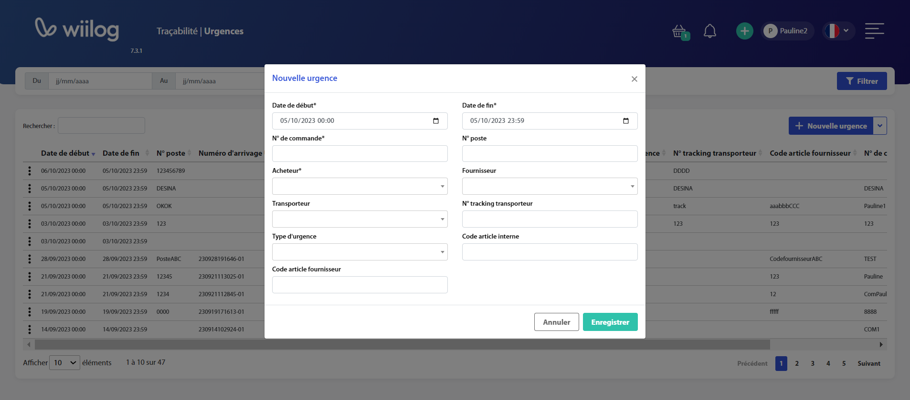

# Urgences

Cette dernière est disponible dans l'onglet **Traçabilité**, puis **Urgences**. Cette page contient plusieurs éléments :&#x20;

* Une **barre de filtre**, permettant de filtrer les données qui sont affichées dans le tableau
* Une **recherche rapide**, permettant également de filtrer les données affichées dans le tableau
* Un bouton <mark style="background-color:blue;">**Nouvelle urgence**</mark>, destiné à la création d'une urgence
* Un bouton <mark style="background-color:blue;">**Exporter au format CSV**</mark>, destiné à exporter l'ensemble des données filtrées (suivant les dates renseignées) au format CSV
* Un **tableau**, regroupant les différentes urgences créées

### Contenu des filtres

| Filtre             | Description                                                       |
| ------------------ | ----------------------------------------------------------------- |
| **Du**             | La tranche basse filtrant sur les dates de début/fin de l'urgence |
| **Au**             | La tranche haute filtrant sur les dates de début/fin de l'urgence |
| **N° de commande** | Le numéro de commande associé à l'urgence                         |

### Contenu du tableau

| Colonne                      | Description                                        |
| ---------------------------- | -------------------------------------------------- |
| **Date de début**            | Date de début de l'urgence                         |
| **Date de fin**              | Date de fin de l'urgence                           |
| **Numéro de commande**       | Numéro de commande associé à l'urgence             |
| **N° poste**                 | Numéro de poste associé à l'urgence                |
| **Acheteur**                 | Acheteur associé à l'urgence                       |
| **Fournisseur**              | Fournisseur associé à l'urgence                    |
| **Transporteur**             | Transporteur associé à l'urgence                   |
| **N° tracking transporteur** | N° de tracking transporteur associé à l'urgence    |
| **Date arrivage**            | Date de création de l'arrivage associé à l'urgence |
| **Numéro d'arrivage**        | Numéro de l'arrivage associé à l'urgence           |
| **Date de création**         | Date de création de l'urgence                      |
| **Code article fournisseur** | Code article fournisseur lié à l'urgence           |
| **Code article interne**     | Code article interne lié à l'urgence               |

### Créer une nouvelle urgence

Afin de créer une nouvelle urgence, il suffit cliquer sur le bouton <mark style="background-color:blue;">**Nouvelle urgence**</mark>. Une modale va alors s'ouvrir, permettant ainsi de renseigner plusieurs champs :&#x20;

* La **date de début**
* La **date de fin**
* Le **numéro de commande**
* Le **numéro de poste**
* L'**acheteur**, lié au [référentiel Utilisateurs](../../parametrages/utilisateurs/utilisateurs.md)
* Le **fournisseur**, lié au [référentiel Fournisseurs](../../referentiel/fournisseurs.md)
* Le **transporteur**, lié au [référentiel Transporteurs](../../referentiel/transporteurs.md)
* Le **numéro de tracking transporteur**
* Le **code fournisseur**
* Le **code article interne**


L'urgence ne sera active qu'entre la date de début et de fin.


Lorsque tous les champs ont été renseignés, il suffit de cliquer sur le bouton <mark style="background-color:blue;">**Enregistrer**</mark>, ce qui créera l'urgence. Il sera possible de retrouver cette dernière dans le tableau présent sur la page.

<figure><figcaption></figcaption></figure>

L'urgence créée se déclenchera lorsqu'un arrivage sera validé entre les dates de début et de fin. Néanmoins, les champs renseignés dans l'arrivage devront également correspondre aux champs suivants dans l'urgence :&#x20;

* Le **fournisseur**
* Le **transporteur**
* Le **numéro de commande**
* L'**acheteur**

Lorsqu'une urgence est déclenchée, une modale apparaitra à l'écran, informant l'utilisateur du caractère urgent de l'arrivage. Ce dernier aura également l'information du numéro de poste concerné. A la validation de l'arrivage, les différents acheteurs recevront un mail les notifiant de l'arrivage de la commande urgente.

### Modifier une urgence

Pour modifier une urgence, cliquez sur la ligne de l'urgence à modifier pour ouvrir la modale de modification.

Modifiez ensuite les champs de la même façon qu'à la création et cliquez sur <mark style="background-color:blue;">**Enregistrer**</mark>.&#x20;

### Supprimer une urgence

Il est également possible de supprimer une urgence en cliquant sur lesà gauche d'une ligne, puis <mark style="background-color:blue;">**Supprimer**</mark>. Une modale de confirmation va apparaitre, nécessitant l'approbation de la suppression de l'urgence. Lors du clic sur <mark style="background-color:blue;">**Supprimer**</mark>, l'urgence sera retirée du tableau.
