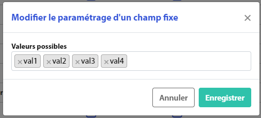

# Champs fixes

Les champs fixes permettent de choisir quels champs sont disponibles sur le formulaire de création d'un acheminement, de modification, et s'il est possible de filtrer sur ce champ ou non.

Pour chaque champ, choisissez les éléments suivants :&#x20;

* **Formulaire de création :**&#x20;
  * **Afficher** : cochez la case pour que le champ soit présent sur le formulaire de création d'acheminement
  * **Obligatoire** : cochez la case pour qu'il ne soit pas possible de créer un acheminement sans que ce champ soit renseigné sur le formulaire de création d'acheminement
* **Formulaire d'édition :**&#x20;
  * **Afficher** : cochez la case pour que le champ soit présent sur le formulaire de modification d'acheminement
  * **Obligatoire** : cochez la case pour qu'il ne soit pas possible de valider la modification d'un acheminement sans que ce champ soit renseigné sur le formulaire de modification d'acheminement
* **Sur les filtres :**&#x20;
  * **Afficher** : cochez la case pour que le champ soit présent dans la barre de filtres de la page des acheminements. Si la case est grisée, cela signifie que ce champ n'est pas disponible au filtrage

Les champs fixes sont paramétrables par Type: cliquez sur le Type souhaité pour paramétrer les champs à afficher/ rendre obligatoire.

<figure><figcaption></figcaption></figure>

Certains champs fixes possèdent également un paramétrage des valeurs disponibles. C'est le cas du champ **Urgence** et **Business unit**. Cliquez sur le libellé du champ fixe pour ouvrir une modale pour paramétrer les valeurs possibles du champ fixe.

Sur les unités logistiques, dans l'acheminement WEB, on a le choix d'afficher ou rendre obligatoire les champs suivants (ce paramétrage s'applique à tous les types):

<figure><figcaption></figcaption></figure>

N'oubliez pas de cliquer sur <mark style="background-color:blue;">**Enregistrer**</mark> pour valider votre modification
