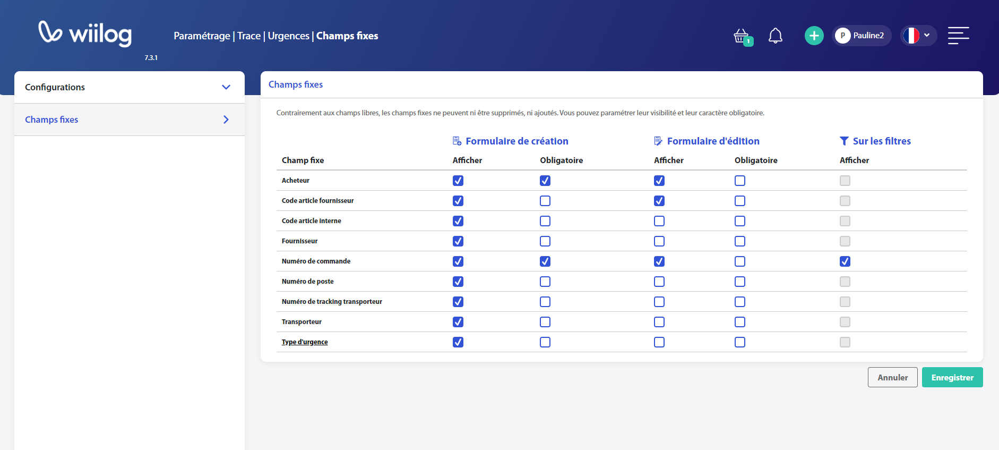

# Champs fixes

Il est également possible de gérer les champs fixes affichés et/ou obligatoires sur les urgences.

<figure><figcaption>
Paramétrage | Trace | Urgences | Champs fixes
</figcaption></figure>
