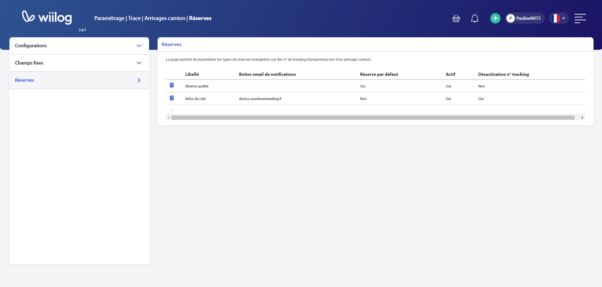

# Arrivages camion

## Configurations

* **Emplacement par défaut de déchargement** : Emplacement par défaut affiché sur le formulaire d'arrivage camion.
* **Paramétrage du retard des numéros de tracking transporteur** : Le paramétrage indique l'heure de création des arrivages camion et avant quand doit être associé un n°tracking transporteur à un arrivage UL, s'il n'est pas traité à temps la ligne de l'arrivage camion s'affiche en rouge et dans le détail de l'arrivage camion le n°de traking transporteur en retard s'affiche en rouge. \
  _Exemple : un arrivage camion créé avant 17h doit être associé à un arrivage UL avant 18h. Un arrivage camion créer après 17:01 doit être associé à un arrivage UL le lendemain avant 10h._



## Champs fixes

Il est possible de choisir les champs fixes que l'on veut voir apparaître lors du remplissage du formulaire de l'arrivage camion. Il peuvent être obligatoires ou non et apparaître dans les filtres de tri de la page d'arrivage camion.&#x20;

<figure><figcaption></figcaption></figure>

## Réserves

Vous pouvez paramétré des types de réserve sur numéro de tracking avec votre vocabulaire mais aussi des envois de mails automatiques à des destinataires sélectionnés parmis vos utilisateurs. Vous pourrez également choisir le type de réserve que vous voulez voir apparaître par défaut lors de la création d'une réserve sur numéro de tracking.&#x20;

<figure><figcaption>
Page des réserves
</figcaption></figure>

Exemples de réserves sur numéro de tracking :&#x20;

* "Manque BL"
* "Mauvais destinataire"
* "Réserve qualité"
* "Réserve douane"

Il est également possible de créer une réserve qui va désactiver le numéro de tracking lorsque celui-ci est refusé dès l'arrivage du camion. Il ne sera pas pris en compte comme tracking à associé à un arrivage d'unité logistique. Il pourra être scanné une nouvelle fois lors d'un prochain arrivage camion.
