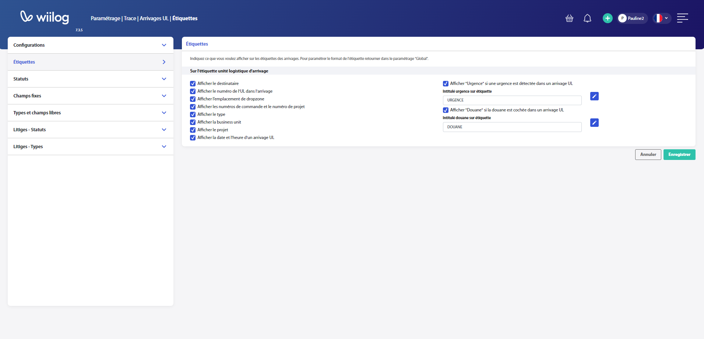

# Arrivages UL

## Configurations&#x20;

Cette section sert à paramétrer les comportements lors de la création d'un arrivage :&#x20;

* **Redirection vers l'arrivage créé** **:** cochez ce paramétrage pour être redirigé vers le détail d'un arrivage lorsque que vous créez un arrivage. Si le paramétrage n'est pas coché, la modale reste ouverte et se vide
* **Envoyer un mail après nouvel arrivage :** si le paramétrage est coché, un mail est envoyé au destinataire renseigné sur l'arrivage à la création de l'arrivage
* **Impressions cochées par défaut :** si le paramétrage est activé, les switch "Imprimer arrivage" et "Imprimer colis" sera tout le temps cochés par défaut à l'ouverture du formulaire de création d'arrivage
* **Impression en double de l'étiquette de colis d'arrivage si champ "Douane" coché :** si le paramétrage est activé, lorsque le switch "Douane" est coché sur le formulaire de création d'un arrivage, à l'impression des étiquettes, celles-ci seront imprimées en double
* **Utilisation des arrivages camion** : Pour utiliser les numéros de tracking transporteur issus des arrivage camion.
* **Emplacement de destination des arrivages :** paramétrez ici l'emplacement de dépose automatique des unités de manutention créés suite à la validation du formulaire des arrivages
* **Emplacement de dépose des arrivages si champ "douane" coché :** paramétrez ici l'emplacement de dépose automatique des unités de manutention créés suite à la validation d'un formulaire de création des arrivages sur lequel le switch "Douane" est coché
* **Emplacement de dépose des arrivages si urgence détectée :** paramétrez ici l'emplacement de dépose automatique des unités de manutention créés suite à la création d'un arrivage détecté comme urgent
* **Emplacement de dépose des arrivages UL si destinataire renseigné:** paramétrez ici l'emplacement de dépose automatique des unités de manutention créés suite à la création d'un arrivage qui a le champ "Destinataire" rempli.

Voici l'ordre de priorité des différents emplacements par défaut:

<figure><figcaption></figcaption></figure>

## Etiquettes

Cette section sert à paramétrer ce qui s'affiche sur les étiquettes des unités de manutention générées suite à un arrivage.&#x20;

<figure><figcaption></figcaption></figure>

* **Afficher le destinataire** : si ce paramétrage est activé et qu'un destinataire est mis sur un arrivage, le nom de ce destinataire sera renseigné sur l'étiquette des unités de manutention de l'arrivage
* **Afficher le numéro de l'unité logistique dans l'arrivage** : activez ce paramétrage pour que sur chaque étiquette soit affiché le numéro du l'unité logistique sur le numéro total d'unité logistique de l'arrivage (1/3,2/3,3/3,...)
* **Afficher l'emplacement de dropzone** : si ce paramétrage est activé, que l'arrivage a un destinataire, et que ce destinataire à une dropzone associée, cette dropzone sera affichée sur les étiquettes des unités de manutention de l'arrivage
* **Afficher les numéros de commande et le numéro de projet** : si ce paramétrage est activé et qu'un numéro de commande et/ou de projet sont renseignés sur un arrivage, ces numéros apparaîtront sur les étiquettes
* **Afficher le type** : activez ce paramétrage pour afficher le type de l'arrivage sur les étiquettes de colis
* **Afficher la business unit** : activez ce paramétrage pour afficher la business unit sur les étiquettes de colis
* **Afficher le projet :** activez ce paramétrage pour afficher le projet associé a l'unité logistique sur l'étiquette.&#x20;
* **Afficher la date et l'heure de l'arrivage :** activez ce paramétrage pour afficher la date et l'heure de l'arrivage de l'unité logistique.
* **Afficher "Urgence" si une urgence est détectée dans un arrivage** : activez ce paramétrage pour ajouter des indications visuelles d'urgence sur les étiquettes des colis d'arrivage en urgence, à paramétrer :&#x20;
  * **Intitulé urgence sur étiquette** : libellé à afficher sur l'étiquette&#x20;
  * **Zone logo** : logo à afficher
*   **Afficher "Douane" si la douane est cochée dans un arrivage** : activez ce paramétrage pour ajouter des indications visuelles sur les étiquettes provenant d'un arrivage identifié comme douane, à paramétrer :&#x20;

    * **Intitulé douane sur étiquette** : libellé à afficher sur l'étiquette
    * **Zone logo** : logo à afficher

<figure><figcaption>
Exemple d'étiquette d'unité logistique
</figcaption></figure>

## Statuts

Le statut sur un arrivage permet de venir indiquer son état. Ces statuts sont paramétrables.

Lorsque vous arrivez sur la partie Statuts, vous avez 2 partie :&#x20;

* une section en haut avec les types des arrivages (vous ne pouvez pas paramétrer les statuts si vous n'avez pas paramétré les types). Cliquez sur un type pour filtrer les statuts par rapport au type
* une section avec la liste des statuts. La liste des statuts est tous types confondus si vous n'avez pas cliquez sur un type. Vous pouvez faire une recherche rapide sur la liste si elle contient plus de 10 lignes. Les colonnes du tableau sont triables.&#x20;

### **Ajouter des statuts**

Pour ajouter des statuts, cliquez sur le bouton **Ajouter des statuts**. La page va alors passer en mode ajout. Si vous souhaitez ajouter plusieurs statuts à la fois, appuyez sur le + en bas de la première ligne. Remplissez le tableau de cette façon :&#x20;

* **Libellé\*** : nom du statut qui apparaîtra dans l'application
* **Etat\*** : état du statut. 3 états sont disponibles :&#x20;
  * _**A traiter**_ : l'arrivage n'est pas finalisé
  * _**Traité**_ : l'arrivage est terminé
  * _**Litige**_ : un litige a été détecté sur l'arrivage ou alors un litige a été ouvert sur l'arrivage
* **Type\*** : type de l'acheminement. Les statuts dépendent du type, ce qui permet d'avoir des workflow différents en fonction du type de l'acheminement
* **Statut par défaut** : cochez ce paramétrage pour que quand un arrivage est créé, il soit mis à ce statut par défaut
* **Ordre\*** : ordre dans la liste des statuts sur le paramétrage

Une fois que vous avez ajouté tous les statuts que vous souhaitez, cliquez sur **Enregistrer**. Ils s'ajouteront dans la liste des statuts.


Ajouter un staut


### **Modifier des statuts**

Pour modifier des statuts, cliquez sur une ligne en mode visualisation pour passer en mode modification. Vous pouvez modifier les champs de la même façon qu'à la création, sauf le type qui ne peut plus être modifié.&#x20;

### **Supprimer des statuts**

Pour supprimer des statuts, cliquez sur la poubelle de la ligne du statut que vous souhaitez modifier, que ce soit en mode visualisation ou modification. Vous ne pouvez pas supprimer un statut s'il est utilisé sur un arrivage.

## Champs fixes

Les champs fixes permettent de choisir quels champs sont disponibles sur le formulaire de création d'un arrivage, de modification, et s'il est possible de filtrer sur ce champ ou non.

Pour chaque champ, choisissez les éléments suivants :&#x20;

* **Formulaire de création :**&#x20;
  * **Afficher** : cochez la case pour que le champ soit présent sur le formulaire de création d'arrivage
  * **Obligatoire** : cochez la case pour qu'il ne soit pas possible de créer un arrivage sans que ce champ soit renseigné sur le formulaire de création d'arrivage
* **Formulaire d'édition :**&#x20;
  * **Afficher** : cochez la case pour que le champ soit présent sur le formulaire de modification d'arrivage
  * **Obligatoire** : cochez la case pour qu'il ne soit pas possible de valider la modification d'un arrivage sans que ce champ soit renseigné sur le formulaire de modification d'arrivage
* **Sur les filtres :**&#x20;
  * **Afficher** : cochez la case pour que le champ soit présent dans la barre de filtres de la page des arrivages. Si la case est grisée, cela signifie que ce champ n'est pas disponible au filtrage

Certains champs fixes possèdent également un paramétrage des valeurs disponibles. C'est le cas du champ **Business unit**. Cliquez sur le libellé du champ fixe pour ouvrir une modale pour paramétrer les valeurs possibles du champ fixe.

.png>)

N'oubliez pas de cliquer sur **Enregistrer** pour valider votre paramétrage.

## Types et champs libres

### **Ajouter un type**

Pour ajouter un type, cliquez sur le bouton **Ajouter un type**, à droite de la liste des types.

Remplissez ensuite les champs des caractéristiques de cette façon :&#x20;

* **Libellé\*** : nom du type, apparaîtra partout dans l'application
* **Description** : description du type, non obligatoire

Vous pouvez ensuite ajouter des champs libres sur ce type en cliquant sur la ligne avec le +, et en complétant le tableau de la façon suivante :&#x20;

* **Libellé\*** : nom du champ libre. Le nom doit être différent de tous les champs libres paramétrés sur l'application&#x20;
* **Typage\*** : contenu du champ. A choisir parmi la liste suivante :&#x20;
  * **Texte** : champ pouvant contenir n'importe quel caractère
  * **Nombre** : champ pouvant contenir seulement des chiffres
  * **Oui/Non** : champ où le choix de réponse est entre Oui ou Non
  * **Date** : champ pouvant contenir seulement une date. Il ouvre un calendrier pour sélectionner une date
  * **Date et heure**: champ pouvant contenir seulement une date et une heure. Il ouvre un calendrier pour sélectionner une date et un sélecteur d'heure
  * **Liste** : valeur du champ à sélectionner parmi une liste de valeurs paramétrée à la colonne suivante. Il sera seulement possible de sélectionner une valeur
  * **Liste multiple** : valeurs du champ à sélectionner parmi une liste de valeurs paramétrée à la colonne suivante. Il sera possible de sélectionner plusieurs valeurs
* **Eléments** : valeurs possibles pour les champs de type Liste et Liste multiple. Ecrivez ici les éléments de la liste, en les séparant par un ;&#x20;
* **Valeur par défaut** : valeur par défaut du champ libre. Selon le type du champ libre, la sélection de la valeur par défaut s'adapte
* **Affiché à la création** : cochez ce paramétrage pour que le champ apparaisse à la création d'un acheminement
* **Obligatoire à la création** : cochez ce paramétrage pour qu'il ne puisse pas être possible de créer un acheminement sans avoir saisi ce champ
* **Obligatoire à la modification** : cochez ce paramétrage pour qu'il ne puisse pas être possible de modifier un acheminement sans avoir saisi ce champ

Une fois que vous avez rempli les caractéristiques et les champs libres du type (vous n'êtes pas obligé d'avoir des champs libres), cliquez sur **Enregistrer** pour voir le nouveau type apparaître à la suite des autres.

### **Modifier un type et ses champs libres**

Pour modifier un type et ses champs libres, cliquez sur le bouton **Modifier** à droite des caractéristiques du type.

La page passe alors en mode modification. Vous pouvez modifier les caractéristiques et les champs libres de la même façon que décrit au-dessus. Le typage des champs libres ne peut pas être modifié.

### **Supprimer un type et ses champs libres**

Vous pouvez supprimer un type et ses champs libres grâce aux poubelles : une à gauche des caractéristiques du type pour supprimer le type, une sur chaque ligne de champs libres pour supprimer un champ libre. Ces poubelles sont présentes en mode visualisation et mode modification.

Pour supprimer un type, le type ne doit plus avoir des champs libres et ne pas être utilisé sur les arrivages.&#x20;

## Litiges - Statuts

Lorsque vous créez un litige sur un arrivage, celui-ci doit passer par une liste de statuts afin d'indiquer sa progression jusqu'à sa clôture. Cette progression est paramétrable par le paramétrage de statut. Sur les litiges, les statuts ne dépendent pas du type.

**Ajouter des statuts**

Pour ajouter des statuts de litige, cliquez sur le bouton Ajouter des statuts à droite. La page va alors passer en mode ajout. Si vous souhaitez ajouter plusieurs statuts à la fois, appuyez sur le + en bas de la première ligne. Remplissez le tableau de cette façon :&#x20;

* **Libellé\*** : nom du statut qui apparaîtra sur l'application
* **Etat\*** : état du statut. L'état du statut sur les litiges permet de savoir s'il est toujours en cours de résolution ou traité. 2 états sont disponibles :&#x20;
  * _**A traiter**_ : le litige n'est pas clôturé
  * _**Traité**_ : le litige est clôtuté
* _**Commentaire litige**_ : commentaire qui apparaîtra automatiquement sur le litige à la sélection du statut
* _**Statut par défaut**_ : à la création du litige, le litige se mettra par défaut sur ce statut
* _**Envoi d'emails aux acheteurs**_ : cochez ce paramétrage pour qu'au passage à ce statut, un mail soit envoyé aux acheteurs de l'arrivage sur lequel il y a un litige
* _**Envoi d'emails au demandeur**_ : cochez ce paramétrage pour qu'au passage à ce statut, un mail soit envoyé au déclarant du litige&#x20;
* _**Ordre**_ : ordre du statut dans la liste des statuts dans le paramétrage

Modifier des statuts

Pour modifier des statuts, cliquez sur une ligne en mode visualisation pour passer en mode modification. Vous pouvez modifier les champs de la même façon qu'à la création.

**Supprimer des statuts**

Pour supprimer des statuts, cliquez sur la poubelle de la ligne du statut que vous souhaitez supprimer, que ce soit en mode visualisation ou modification. Vous ne pouvez pas supprimer un statut s'il est utilisé sur un litige.

## Litiges - Types

Les types de litige servent à venir caractériser votre litige.&#x20;

Pour **ajouter un type** de litige, cliquez sur le +. Si vous étiez en mode visualisation, vous passerez en mode modification. Si vous étiez en mode modification une ligne s'ajoutera juste.&#x20;

Remplissez alors les champs suivant :&#x20;

* **Libellé\*** : libellé du litige
* **Description** : description du litige

Cliquez sur **Enregistrer** pour bien ajouter votre type.

Pour **modifier un type** de litige, cliquez sur la ligne du type à modifier pour passer en mode modification, et enregistrer.

Pour **supprimer un type**, cliquez sur le bouton Poubelle de la ligne du type de litige que vous souhaitez supprimer. Ce type ne peut pas être supprimé s'il est utilisé.&#x20;
