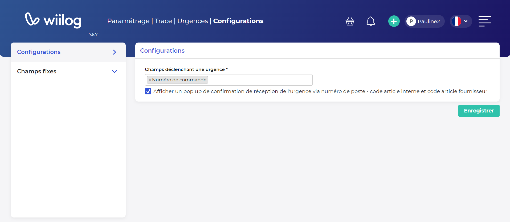

# Urgences

## Configurations&#x20;

* Il est possible de sélectionner parmis les champs "Fournisseurs", "Transporteurs" et "Numéro de commande" le champ qui déclenchera l'urgence sur l'arrivage d'unités logistiques.&#x20;

En effet, si le numéro de commande renseigné dans l'urgence correspond à celui renseigné dans l'arrivage UL et qu'il est configuré comme "Champ déclenchant une urgence" alors l'urgence s'activera sur l'arrivage UL.

* Vous pouvez également utiliser le paramétrage "Afficher pop up de confirmation de réception de l'urgence" qui permet, lors de l'arrivage UL, de confirmer ou infirmer si le colis arrivé est bien celui concerner par l'urgence. Vous pouvez ainsi repousser une urgence sur un autre arrivage s'il s'agit d'un seul numéro de commande mais plusieurs arrivages distincts ou un seul colis concerner par l'urgence.&#x20;

<figure><figcaption></figcaption></figure>

## Champs fixes

Il est également possible de gérer les champs fixes affichés et/ou obligatoires sur les urgences.

<figure><figcaption></figcaption></figure>
