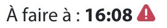

# Demandes

Cette page permet de récapituler toute les demandes de transport faites. Elle regroupe les demandes de livraison et de collecte. À noter que ces demandes de livraison et collecte sont différentes de celle présentés dans la partie Stock.

Cette fonctionnalité est disponible dans le menu <mark style="background-color:blue;">**Demande**</mark>, puis <mark style="background-color:blue;">**Transport**</mark>. Cette page contient plusieurs éléments :&#x20;

* Une **barre de filtre**, permettant de filtrer les données qui sont affichées dans le tableau
* Un bouton **Exporter au format CSV**, destiné à exporter l'ensemble des données filtrées (suivant les dates et le transport renseignés) au format CSV
* Un **tableau** sous forme d'étiquette, regroupant les différentes demandes de transports créées


Page demande de transport



Pour accéder au détail d’une demande de transport, cliquez sur la vignette d’une demande dans la liste des demandes de transport.


## Contenu des filtres

| Filtre                | Description                                                                                                                                                                                |
| --------------------- | ------------------------------------------------------------------------------------------------------------------------------------------------------------------------------------------ |
| **Du**                | 
La tranche basse filtrant sur la date de demande renseigné lors de la création. Par défaut la date du jour est renseigné, pour filter sur les demandes du jour et dans le future
 |
| **Au**                | La tranche haute filtrant sur la date de demande renseigné lors de la création.                                                                                                            |
| **Demandeurs**        | Personne ayant crée la demande                                                                                                                                                             |
| **Numéro de dossier** | Numéro de dossier du patient à livrer                                                                                                                                                      |
| **Patient**           | Nom et prénom du patient à livrer                                                                                                                                                          |
| **Statut**            | Statut des demandes de livraison et collecte sans doublons, dans l'ordre du process                                                                                                        |
| **Transport**         | Pour choisir d'afficher seulement les demandes de livraison ou de collecte                                                                                                                 |
| **Type**              | Le type de la demande de livraison et de collecte                                                                                                                                          |


Dans le cas de la collecte, la date planifiée (cette à dire la date de passage validé avec le patient) vient prendre le pas sur la date demandée.


## Contenu du tableau

La date en bleu, est la date de demande renseignée lors de la création de la demande. Puis il y a un récap du nombre de demandes de livraison et de collecte par jour.

Un bouton <mark style="background-color:blue;">**Exporter au format CSV**</mark>, destiné à exporter l'ensemble des données filtrées (suivant les dates et le transport renseignés) au format CSV.

Une liste d'étiquettes par demande, le détail d'une étiquette de livraison et collecte est détaillés par la suite.

### Contenu d'une étiquette de livraison

<table><thead><tr><th width="240.5">Information</th><th>Description</th></tr></thead><tbody><tr><td>Livraison</td><td>Indication du choix du transport</td></tr><tr><td>DTR220615-16</td><td>Numéro de la demande de transport au format  (DTRaammjj-N) (DTR pour Demande de TRansport)</td></tr><tr><td>Terminée</td><td>Statut de la demande. Le statut évolue automatiquement en fonction de l’avancée de la demande</td></tr><tr><td>À faire à : </td><td>Heure voulu de la livraison</td></tr><tr><td>Estimé à : (ou) Faite à : </td><td>Heure estimé de la livraison (ou) heure de réalisation de la livraison, Si vous avez le texte « Non disponible » derrière « Estimée à : », cela signifie que la demande est sous-traitée, et donc que le suivi en temps réel n’est pas disponible.</td></tr><tr><td>Médicament</td><td>Type de la demande (Pour le cas d’une livraison/collecte, vous ne verrez que le type de la livraison à ce niveau.)</td></tr><tr><td>Royale Provencher</td><td>Nom du partient à livrer</td></tr><tr><td>N° de dossier</td><td>Numéro de dossier du patient renseigner sur la demande</td></tr><tr><td>Créer le :</td><td>Date de création de la demande</td></tr><tr><td>Par :</td><td>Personne qui à créé la demande</td></tr></tbody></table>


Exemple demande de livraison



Les Livraison/collecte ont les mêmes informations que les livraisons


À gauche de l'étiquette se trouve . Selon le statut de la demande vous aurez accès à différentes actions, voici les différentes possibilités.

| Statuts                  | Actions                                                                                                            |
| ------------------------ | ------------------------------------------------------------------------------------------------------------------ |
| En attente de validation |                                                                                                                    |
| À préparer               | <ul><li>Imprimer les étiquettes</li><li>Générer un bon de transport (Si colisage fait)</li><li>Supprimer</li></ul> |
| À livrer                 | <ul><li>Imprimer les étiquettes</li><li>Générer un bon de transport (Si colisage fait)</li><li>Supprimer</li></ul> |
| En cours                 | <ul><li>Imprimer les étiquettes</li><li>Générer un bon de transport</li><li>Annuler</li></ul>                      |
| Terminée                 | <ul><li>Générer un bon de transport</li></ul>                                                                      |
| Sous-traité              | <ul><li>Imprimer les étiquettes</li><li>Supprimer</li></ul>                                                        |

Sur une étiquette vous pouvez aussi retrouver 2 icones :&#x20;

* Indication de colis écarté : La livraison contient des colis qui ont été rejetés par le livreur car non trouvés ou abîmés par exemple
* Indication livraison rejetée :une livraison peut être rejetée pour 2 raisons:
  * Tous les colis de la demande ont été écartés, aucun ne peut être livré en l’état. Dans ce cas, le statut de la demande qui était à «A livrer» passe à «A préparer» et il vous faut ré imprimer des étiquettespour qu’elle soit planifier ensuite sur une autre tournée
  * La livraison n’était pas préparée: aucun colis n’était disponible pour cette livraison. La demande reste alors au statut «A préparer». Il faudra la planifier sur une autre tournée dans la journée
* Indication de l'urgence : Le triangle rouge indique que la livraion à été qualifiée d’urgente&#x20;

### Contenu d'une étiquette de collecte

<table><thead><tr><th width="240.5">Information</th><th>Description</th></tr></thead><tbody><tr><td>Collecte</td><td>Indication du choix du transport</td></tr><tr><td>DTR220630-03</td><td>Numéro de la demande de transport au format  (DTRaammjj-N) (DTR pour Demande de TRansport)</td></tr><tr><td>À collecter</td><td>Statut de la demande. Le statut évolue automatiquement en fonction de l’avancée de la demande</td></tr><tr><td>Planifiée le : </td><td>Jour de collecte planifié avec le patient. Si aucune date n’apparaît, cela signifie que le patient n'a pas encore été appelé pour convenir d’une date de passage avec lui.</td></tr><tr><td>Estimée à : (ou) Faite à : </td><td>Créneau de passage renseigné avec le patient (ou) heure réel de la collecte</td></tr><tr><td>DASRI</td><td>Type de la demande</td></tr><tr><td>Pierre de L'homme</td><td>Nom du partient à collecté</td></tr><tr><td>N° de dossier</td><td>Numéro de dossier du patient renseigner sur la demande</td></tr><tr><td>Créer le :</td><td>Date de création de la demande</td></tr><tr><td>Par :</td><td>Personne qui à créé la demande</td></tr></tbody></table>


Exemple demande de collecte


À gauche de l'étiquette se trouve . Selon le statut de la demande vous aurez accès à différentes actions, voici les différentes possibilités.

| Statuts                     | Actions                                                     |
| --------------------------- | ----------------------------------------------------------- |
| En attente de validation    | <ul><li>Imprimer les étiquettes</li><li>Supprimer</li></ul> |
| En attente de planification | <ul><li>Supprimer</li></ul>                                 |
| À collecter                 | <ul><li>Supprimer</li></ul>                                 |
| En cours                    | <ul><li>Annuler</li></ul>                                   |

## Exporter les données

Vous avez la possibilité d’exporter toutes les demandes et leurs données en format CSV (lisible sous excel).

Pour cela, renseignez d’abord des filtres de dates dans les filtres, et sélectionnez **Livraison** ou **Collecte**, pour exporter soit les demandes de livraison, soit les demandes de collecte. Cliquez ensuite sur <mark style="background-color:blue;">**Exporter au format CSV**</mark>. Vous obtiendrez les demandes de livraison ou de collecte créées entre les bornes de dates sélectionnées.
