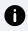
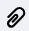
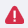

# Détails livraison et collecte

Le détail d’une demande de transport est constitué de 4 zones :

* La première colonne qui contient **l’historique des statuts** de la demande et ses informations principales
* La zone **Colis** dans la deuxième colonne
* La zone **Historique de transport** dans la deuxième colonne
* La zone **Données** dans la troisième colonne


Détails d'une demande de livraison


## Historique des statuts et informations principales

La première colonne est constituée de 5 parties différentes :&#x20;

#### Entête des informations :

* En haut à gauche : le numéro de la demande de transport
* En haut à droite : le nom de l’utilisateur ayant créé la demande de transport
* Plus bas à gauche : si la demande est une livraison ou une collecte. Dans l’exemple, il s’agit d’une livraison/collecte
* Plus bas au milieu : type de la livraison et/ou de la collecte
* En haut du bandeau avec le statut (non visible sur la capture) : si vous avez indiqué une urgence, un bandeau rouge sera positionné avec le niveau de l’urgence

**Historique des statuts** : cette partie sert à suivre l’avancée de la demande. Cette historique varie en fonction de si la demande est une livraison, une livraison/collecte, ou une collecte. Le bandeau est haut est le statut en cours de la demande (en vert). Les statuts en bleu sont les statuts passés, en vert le statut en cours, en gris les statuts futurs. Des statuts peuvent être rouges également dans le cas d’événements (voir plus bas)

**Dates** : cette partie contient les différentes dates importantes pour la demande. Dans le cas d’une livraison, ou d’une livraison/collecte, elle contiendra la date et l’heure attendue de livraison. Dans le cas d’une collecte, elle contient la date attendue de collecte et la date validée avec le patient (si elle a été renseignée)

**Autres informations** : cette partie contient toutes les autres informations sur la demande, qui changent en fonction du type de la demande

**Informations Patient** : récapitulatif des informations du patient.


Historique des statuts et informations


## Colis

La zone Colis permet de savoir les éléments à livrer ou à collecter.

Pour les **livraisons**, chaque ligne en gris représente une nature de colis à livrer avec sa température associée (s’il y en a une). Si le colisage a été fait, la quantité est indiquée et sous chaque ligne en gris, le code de chaque étiquette éditée est indiqué avec les colonnes « Ecarté » et « Motif écartement » qui se remplira au démarrage d’une tournée (voir Suivi d’une demande)

Pour les **collectes**, chaque ligne en gris représente une nature d’objet à collecter, avec une quantité à collecter si elle a été indiquée, et la quantité collectée une fois que la collecte est terminée.


Liste de colis


## Historique de transport

La partie Historique de transport permet de voir tous les événements qui se sont passés sur la demande, et qui ne sont pas forcément visibles sur l’historique des statuts de la demande.

Chaque événement est représenté par une icône :&#x20;

 : Icône d’historique de statut. Cela veut dire que l’événement a un impact sur le statut de la demande

 : Information non liée à l’historique des statuts

 : Commentaire ajouté lors du traitement d’une demande

 : Photo ou signature ajouté lors du traitement d’une demande

 : Problème rencontré lors du traitement de la demande


Exemple historique de donnée


## Données

La partie Données contient 2 parties :

* Une partie **Dernière position connue** : la carte est zoomée sur l’adresse du patient, et si la tournée sur laquelle va être traitée la demande est en cours, la dernière position du livreur sera visible sur la carte (sous la forme d’une icône Camion)
* Une partie **Courbes de températures** : cette partie est seulement disponible pour les livraisons pour lesquelles le suivi de température est nécessaire pour des colis. Il y aura autant de graphiques que de réfrigérateurs dans lesquels les colis ont été mis. Les bornes de températures à respecter sont matérialisées par une ligne bleue pour la borne basse et une ligne rouge pour la borne haute. Quand la tournée sur laquelle la demande va être traitée commence, les relevées de température apparaissent sur tout le temps de traitement de la demande de livraison


Dans le cas où la demande est sous-traitée, aucune donnée de suivi ne remontera sur cette partie.



Partie Données


## Supprimer / Annuler une demande

### Supprimer une demande

Il est possible de supprimer une demande tant que la demande n’a pas été affectée à une tournée. La demande a été affectée à une tournée si vous avez un créneau horaire derrière « Estimée à : »

Pour supprimer une demande à partir de Demande | Transport, cliquez sur, si le bouton <mark style="background-color:blue;">**Supprimer**</mark> apparait parmi les boutons disponibles, c’est qu’il est possible de supprimer la demande. Cliquez dessus. Une modale de confirmation apparaît alors. Cliquez sur <mark style="background-color:blue;">**Supprimer**</mark> pour confirmer la suppression.

Vous pouvez aussi supprimer une demande à partir de Demande | Transport | Détails. Cliquez sur lesen haut à gauche et cliquez sur <mark style="background-color:blue;">**Supprimer**</mark>. La modale de confirmation sera aussi présente.

### Annuler une demande

Une fois que la demande est affectée à une tournée, vous ne pouvez plus la supprimer. Il vous est alors possible d’annuler la demande.

Le bouton Annuler remplace le bouton Supprimer. Lorsque vous cliquez sur <mark style="background-color:blue;">**Annuler**</mark>, une modale de confirmation apparaît. Cliquez sur <mark style="background-color:blue;">**Annuler**</mark> pour confirmer l’annulation de la demande.

Lorsque vous annulez une demande, la demande passe en statut Annulée. Sur la tournée paramétrée par le responsable d’exploitation, le point de passage de cette demande passe en annulé.

Si la tournée est en cours, le livreur recevra une notification si la demande annulée est son prochain point de passage. Sinon il verra dans sa liste des points de passage que la demande n’est plus à faire. S’il s’agit d’une livraison, il faudra qu’il retourne les colis de la livraison.

## Modifier une demande

Vous pouvez modifier une demande de livraison ou de collecte en allant sur le détail de la demande et en cliquant sur lesen haut à gauche puis sur <mark style="background-color:blue;">**Modifier la livraison**</mark> ou <mark style="background-color:blue;">**Modifier la collecte**</mark>. Selon si la demande a été affectée sur une tournée ou non vous n’allez pas pouvoir modifier les mêmes éléments.


Vous ne pouvez plus rien modifier à partir du moment où la demande est en cours.


### La demande n’est pas affectée sur une tournée

Tant que la demande n’est pas planifiée sur une tournée, vous avez la possibilité de modifier n’importe quel champ, que ça soit sur la livraison ou sur la collecte, excepté le patient et son n° de dossier.

Pour les livraisons/collectes, vous disposez d’un bouton pour modifier les caractéristiques de la livraison, et un autre pour modifier les caractéristiques de la collecte. Si vous souhaitez modifier des informations Patient ou la date, il vous faudra aller modifier ces éléments via le bouton Modifier la livraison.

Attention si vous modifiez la date : selon la date que vous renseignez, votre demande qui était sur un historique de statut classique peut passer sur le process de validation de demande ou passer directement sous-traité.

### La demande est affectée à une tournée

Une fois que la demande est affectée à une tournée, vous ne pouvez plus modifier :

* L’adresse du patient
* La date de collecte ou la date et l’heure de livraison
* Le niveau d’urgence, pour les livraisons

### Modifier les colis

Vous avez la possibilité jusqu’au dernier moment avant que le livreur commence sa tournée de venir modifier la section colis.

#### Pour les **livraisons** :

* Vous n’avez pas encore fait le colisage et souhaitez ajouter une nouvelle nature : accédez au formulaire de modification et sélectionnez une nouvelle nature de colis. Enregistrez vos modifications
*   Vous avez fait le colisage et souhaitez ajouter des nouveaux colis : accédez au formulaire de modification et venez modifier la quantité pour une nature déjà sélectionnée, ou cliquez sur une nature et renseignez la quantité pour un colis d’une nouvelle nature. Cliquez sur Imprimer les étiquettes pour générer les étiquettes dans la foulée

    Vous ne pouvez pas supprimer un code colis déjà généré. Le livreur devra l’écarter de la livraison s’il n’est plus à livrer.

#### Pour les collectes :

Si finalement vous êtes en mesure d’indiquez le nombre d’objet à collecter ou que vous souhaitez ajouter une nature d’objet à collecter, accédez au formulaire de modification de collecte. Modifiez la quantité dans le champ correspondant comme lors de la création ou bien sélectionnez une nouvelle nature à collecter. Enregistrez vos modifications.
