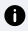
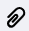

# Détails d'un ordre de transport

Le détail d’une demande de transport est constitué de 5 zones :

* La première colonne qui contient **l’historique des statuts** de l’ordre et les informations
* La zone **Informations Patient** dans la deuxième colonne
* La zone **Historique de transport** dans la deuxième colonne
* La zone **Colis** dans la troisième colonne
* La zone **Données** dans la troisième colonne


Détails ordre de transport


### Historique des statuts et informations

<figure><figcaption>
Détails d'un ordre de transport, partie gauche
</figcaption></figure>

1. **Entête des informations**. Cette partie contient :\
   \- En haut à gauche : le numéro de l’ordre de transport\
   \- En haut à droite : le nom de l’utilisateur ayant créé la demande de transport\
   \- Plus bas à gauche : si la demande est une livraison ou une collecte. Dans l’exemple, il s’agit d’une livraison/collecte\
   \- Plus bas au milieu : type de la livraison et/ou de la collecte\
   \- En haut du bandeau avec le statut : si le CLB a indiqué une urgence, un bandeau rouge sera positionné avec le niveau de l’urgence
2. &#x20;**Historique des statuts** : cette partie sert à suivre l’avancée de l’ordre.\
   Cette historique varie en fonction de si l’ordre est une livraison, une livraison/collecte, ou une collecte. Le bandeau est haut est le statut en cours de l’ordre (en vert). Les statuts en bleu sont les statuts passés, en vert le statut en cours, en gris les statuts futurs. Des statuts peuvent être rouges également dans le cas d’événements
3. **Dates** : cette partie contient les différentes dates importantes pour la demande. Dans le cas d’une livraison, ou d’une livraison/collecte, elle contiendra la date et l’heure attendue de livraison. Dans le cas d’une collecte, elle contient la date attendue de collecte et la date validée avec le patient (si elle a été renseignée) ainsi que le créneau de passage
4. **Détails transports** : cette partie contient les informations de la tournée sur laquelle est positionnée l’ordre. Si vous avez affecté l’ordre à la tournée, vous verrez le numéro de la tournée (qui est un lien cliquable et permet d’accéder au détail de la tournée) et le livreur qui va réaliser la tournée
5. **Autres informations** : cette partie contient toutes les autres informations sur la demande, qui changent en fonction du type de la demande

### Informations Patient

Cette partie récapitule les différentes informations du patient, décrite lors dela création de la demande transport.


Détails d'un ordre de transport, partie Informations patient


### Historique de transport

La partie Historique de transport permet de voir tous les événements qui se sont passés sur la demande et l’ordre, et qui ne sont pas forcément visibles sur l’historique des statuts de l’ordre.


Détails d'un ordre de transport, partie Historique de transport


Chaque événement est représenté par une icône :&#x20;

 : Icône d’historique de statut. Cela veut dire que l’événement a un impact sur le statut de l'ordre

 : Information non liée à l’historique des statuts

 : Commentaire ajouté lors du traitement d’une demande

 : Photo ou signature ajouté lors du traitement d’une demande

 : Problème rencontré lors du traitement de la demande

### Colis

La zone Colis permet de savoir les éléments à livrer ou à collecter.


Détails d'un ordre de transport, partie Colis


Pour les livraisons, chaque ligne en gris représente une nature de colis à livrer avec sa température associée (s’il y en a une). Si le colisage a été fait, la quantité est indiquée et sous chaque ligne en gris, le code de chaque étiquette éditée est indiqué avec les colonnes « Ecarté » et « Motif écartement » qui se remplira au démarrage d’une tournée (voir Suivi d’une demande)

Pour les collectes, chaque ligne en gris représente une nature d’objet à collecter, avec une quantité à collecter si elle a été indiquée, et la quantité collectée une fois que la collecte est terminée.

### Données

La partie Données contient 2 parties :

* Une partie **Dernière position connue** : la carte est zoomée sur l’adresse du patient, et si la tournée sur laquelle va être traitée la demande est en cours, la dernière position du livreur sera visible sur la carte (sous la forme d’une icône Camion)
* Une partie **Courbes de températures** : cette partie est seulement disponible pour les livraisons pour lesquelles le suivi de température est nécessaire pour des colis. Il y aura autant de graphiques que de réfrigérateurs dans lesquels les colis ont été mis. Les bornes de températures à respecter sont matérialisées par une ligne bleue pour la borne basse et une ligne rouge pour la borne haute. Quand la tournée sur laquelle la demande va être traitée commence, les relevées de température apparaissent sur tout le temps de traitement de la demande de livraison


Détails d'un ordre de transport, partie Données


## Valider la date de collecte avec le patient

Afin de pouvoir planifier une collecte sur une tournée, il vous faut valider la date de collecte et le créneau de passage avec le patient.

Pour cela, allez dans Ordre | Transport et filtrez sur le statut « Patient à contacter » pour avoir toutes les collectes qui n’ont pas de date validée avec le patient.

Cliquez ensuite sur la vignette d’une collecte, et une fois que vous avez convenu sur de la date et du créneau avec le patient, cliquez sur <mark style="background-color:blue;">**Renseigner date patient**</mark>. Une modale s’ouvrira alors. Renseignez la date validée avec le patient et le créneau de passage. Les créneaux sont ceux qui sont renseignés dans le paramétrage ([Global > Heures travaillées > Créneaux horaires](../../../../parametrages/global/heures-travaillees.md#creneaux-horaires)).


Validation de la date de collecte avec le patient


Lorsque vous avez validé cette date, la collecte est envoyée sur le planning et vous pouvez la positionner sur une tournée.

Vous avez la possibilité de modifier cette date à volonté tant que la collecte n’est pas sur une tournée, c’est-à-dire est au statut « A affecter ».
